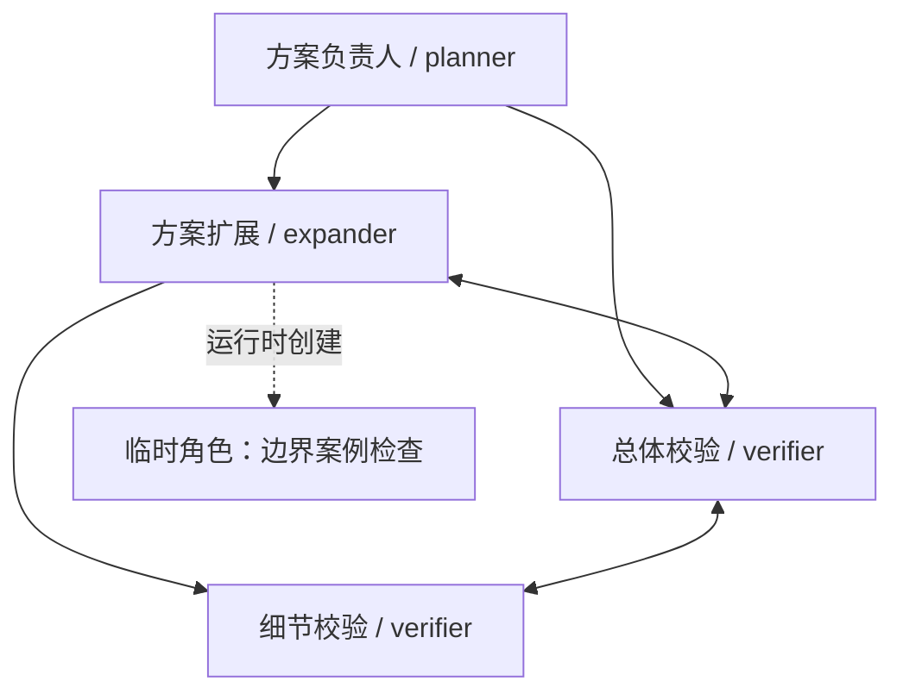
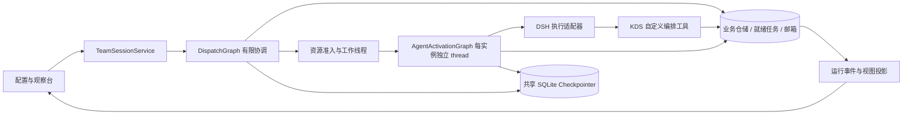
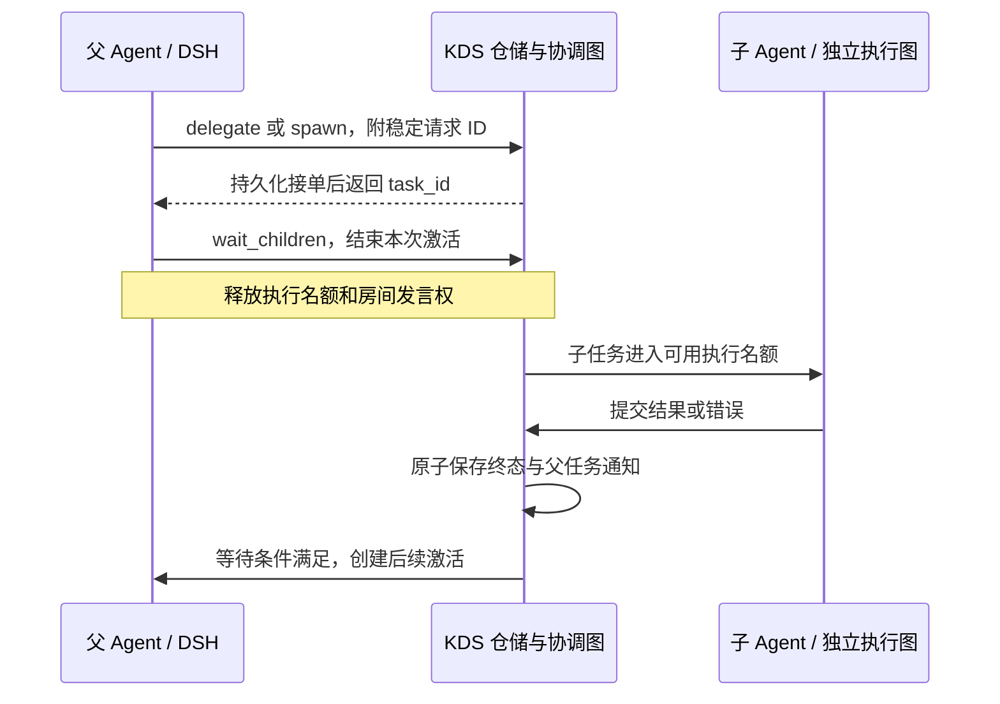

# 基于 LangGraph 的图形化多 Agent 对话系统计划

> 实施核对（2026-10-02）：基线已验证；功能在从 `main@29da95a` 创建的 `graph` 分支实施。原始计划正文保留，实际协议补充、交付范围、测试结果及边界见 [graphical-multi-agent-validation.md](graphical-multi-agent-validation.md)，使用说明见 [teams-guide.md](teams-guide.md)。下文“编写阶段未实施”指最初计划编写时的状态。

> 用户要求修订（2026-10-03）：同一对节点最多一种连接，单次输出留空为无限，工具从服务器有限目录选择；新增有论文来源的角色／团队预设与可调侧栏。对应规则已在正文更新，预设依据见 [team-presets.md](team-presets.md)。真实 API 测试已单独获准，其结果与具体边界在验证报告另行记录。

> 独立新计划，编写日期：2026-10-02。已按要求拉取远程 `main`；本次新增本文，不改写旧计划，不实施业务代码、依赖或数据库变更。
> 文档分支及实现分析基线：`main`，提交 `29da95a82103bd068aa53fd0798711a731958cfa`，即已合并 LangGraph 重构的版本。
> 以下代码路径均指该基线；“现有实现”与“拟实施能力”分别说明。本文可独立阅读，不依赖之前的多 Agent 计划。

## 1. 产品目标与已确认选择

将 KDS 从“一个群聊中依次发言的多个角色”，扩展为用户可在画板上配置、启动并观察的 Agent 团队。每个节点是独立 Agent；父节点可以向子节点派发任务，子节点完成后回传结果；通过双向边连接的节点按传递关系组成群聊。所有实际 Agent 均由 DSH 执行，LangGraph 管理可恢复的工作流程。

本轮用户已确认：

| 决策 | 确认结果 | 对计划的影响 |
| --- | --- | --- |
| 群聊如何讨论 | 按任务需要、人工消息或明确提及触发有限讨论 | 房间默认静默等待事件，不持续自动轮流发言 |
| 子 Agent 的角色来源 | 允许 Agent 临时设计新角色及提示词 | 同时支持角色库模板与运行时临时角色；临时角色可被观察、追踪和保存 |
| 运行中编辑画板 | 保存为新版本，下次运行生效 | 启动时冻结用户定义的拓扑；Agent 自主创建子节点作为本次运行的增量记录 |
| 给单个 Agent 发人工消息 | 只作为补充信息排队，不提供手动派任务或取消任务按钮 | 不抢占激活、不自动创建任务、不解除子任务等待；保留整场运行的控制 |

由原始需求或现有产品合同直接确定的规则：

- 任务有向关系采用树或森林，每个节点最多一个父节点，不支持一个实例同时归属多个父节点。相同角色可通过多个独立实例复用。
- 双向边形成群聊连通分量，任务边和群聊边各自解释；不把双向边当作两条派发任务的边。
- 同一实例最多执行一个激活；不同实例可以并行。等待子任务是业务状态，不占据模型执行名额。
- 用户可随时切换群聊或 Agent 观察状态；页面切换不改变后台执行。
- 保留“任务可以自动完成，整次对话只有人类手动完成”的区别。预算到限、用户暂停、任务暂时全部结束，都不等于人工确认完成。

多父节点 DAG、任意重叠群聊、运行中任意合并或拆分既有群聊、多机调度、多人同时编辑画板，均不作为首个完整版本的前置功能。

## 2. LangGraph 重构已经提供什么

### 2.1 已实现能力及复用方式

| 基线中的模块 | 已实现事实 | 本计划如何利用 |
| --- | --- | --- |
| `app/services/conversations.py` | `ConversationService` 统一新建、恢复、删除和迁移；按持久化标识选择 legacy 或 LangGraph | 保留旧入口，增加团队会话类型的创建与恢复，避免各 API 自己实例化运行器 |
| `app/orchestration/turn_graph.py`、`nodes.py` | 有限 `TurnGraph` 包含控制、人工消息、评分、选人、执行、校验、提交、结束投票 | 提取已有节点职责，构建面向单个实例的有限激活图；不重新引入包含业务分支的大循环 |
| `app/orchestration/runtime.py` | `GraphRunner` 继承旧对话门面，管理线程、执行代次、操作回执、恢复和取消 | 复用运行时与业务节点分层，提取外部调用对账能力；拆开目前整场对话共用的运行状态 |
| `app/orchestration/batch_graph.py` | `Send` 分发评分／票据，按 Agent ID 归并，`Overwrite` 初始化批次，汇合时要求全部结果 | 继续用于有限成员的辅助批次；不把任意长子任务塞入同一个全批次屏障 |
| `vote_graph.py`、`summary_graph.py` | 投票和人工总结有独立图；总结失败仍保留人工完成合同 | 按房间／整场会话限定工作范围，替换模型执行适配器后继续复用 |
| `app/repositories/orchestration.py` | 短事务、`state_rev` CAS、`runner_epoch`、command／operation／attempt、用量去重、原子业务提交 | 在此基础上增加任务、邮箱、结果回传与实例级代次；保留确定结果回执的复用规则 |
| `app/orchestration/checkpointer.py` | 共享 SQLite saver、线程锁、WAL、同步图持久化、按对话前缀删除检查点 | 复用 saver 生命周期与删除保护，为协调器、每个实例及房间辅助图分配独立 thread ID |
| `app/domain/context.py`、`whiteboard.py` | 上下文、角色设定可见性、白板操作等纯业务规则已提取 | 扩展为按任务和房间投影上下文，保留权限检查和既有白板操作 |
| `app/harness.py`、`app/dsh/bridge.mjs` | DSH 会话复用、工具限制、轮内预算、取消、用量事件、有限恢复资料 | 扩展独立实例的运行时管理及编排工具，保留 DSH 工具循环 |
| `app/static/js/app.js` | 单页配置、聊天、人工输入、白板、工具日志与轮询 | 复用消息和日志组件，新增画板、角色库、任务树与多视图观察台 |

基线固定依赖为 `langgraph==1.2.12`、`langgraph-checkpoint-sqlite==3.1.1`、`langgraph-checkpoint==4.2.0`、`langchain-core==1.6.6`、`langsmith==0.3.45`；DSH SDK 为 `0.1.5rc1`。本计划优先基于这些版本验证，不把升级框架作为拓扑功能的必要步骤。

### 2.2 不能当成已经完成的能力

1. 当前仍是单群聊模型：`messages`、`harness_activity`、白板与轮次位于同一个 Runner；没有角色库、任务树或房间实体。
2. 当前并行化主要发生在评分／投票批次；公开发言仍逐个提交，不等于多个独立 Agent 任务已经能够并行。
3. `AgentTurnExecutor` 仍依赖 Runner 的单份状态，且真实执行可走 direct 或 DSH；辅助评分、投票、总结和配置助手仍直连模型。
4. `TurnNodes.commit_turn()` 用消息数量和白板版本判断输入是否过期。在多房间模式下，其他房间新增消息不能再导致本任务结果被作废。
5. 人工预约仍是每个对话一个槽位，后一次覆盖前一次；团队模式必须改为明确收件范围的持久化队列。
6. 业务数据库与检查点数据库分离，二者没有跨库原子事务；已有 operation／attempt 回执仍是恢复的重要依据。
7. 用量去重已经存在，严格的并发预算预留尚未实现；DSH 跨进程恢复仍是新 session 加授权历史和有限资料，不是完整私有状态恢复。
8. 性能优化已停止新增 `committed_snapshot` 全量副本，并增加元数据和操作树查询；新功能不应重新为每个子任务复制全场历史。

[重构验证记录](langgraph_validation.md)、[性能验证记录](langgraph_performance.md)记录了既有验证结果。本文只核对代码与记录，没有重新运行这些测试；性能文档提及的预约覆盖、总结 attempt 恢复和 DSH 取消后操作收尾，应列入实施前的回归核对，不视为已解决。

## 3. 用户看到的工作流程

### 3.1 配置团队

1. 在角色库定义 planner、expander、verifier 等角色，配置提示词、模型配置引用、工具权限和默认预算。
2. 将角色放到画板中生成节点，同一 verifier 可以放置多次；为每个节点设置实例名称和必要的提示词补充。
3. 选择“父子任务”连线，绘制父节点指向子节点的有向边；选择“群聊连接”，绘制双向边。
4. 系统实时显示父子关系错误和群聊分组。用户保存配置，选择根节点、输入目标及运行预算，然后启动。
5. 配置和角色版本作为本次运行快照保存；后续编辑产生新版本，不修改正在执行的角色设定或既有关系。

画板首版使用现有原生前端技术，采用 HTML 节点卡片与 SVG 连线，支持拖动、平移缩放、框选、删除、撤销／重做、适配视图和自动树形布局。角色属性与连线属性在侧栏编辑；单节点即可启动，不继承旧群聊至少两人的限制。

### 3.2 运行观察台

| 区域 | 内容 |
| --- | --- |
| 运行拓扑 | 展示冻结的静态节点和本次新增的动态节点，以文字／图标显示待命、排队、执行、等待、暂停、失败等状态 |
| 左侧导航 | 总览、任务树、群聊列表、全部 Agent；提供搜索、未读和异常提示 |
| 主视图 | 所选群聊的消息流，或所选 Agent 的任务、输入、交付、工具日志与子 Agent |
| 详情侧栏 | 当前任务、等待对象、DSH 阶段、预算、错误、产物与父任务来源 |
| 控制区 | 全局暂停／继续／完成、调整运行上限，向明确对象发送补充消息；不放置单 Agent 手动派任务或取消任务按钮 |

派发记录可以跳到子任务；结果记录可以跳回父任务。动态 Agent 标明创建者和角色来源，并允许将其临时角色保存为角色库模板。新增角色不会在未经用户保存的情况下污染全局角色库。

原来的 Markdown／HTML 白板继续作为产出物，入口名称与拓扑画板区分。工具日志只展示操作过程，不展示模型内部思考内容。

用户向单个 Agent 发消息时，只新增一条补充信息：执行中的实例在下次激活读取，等待子任务的实例继续等待，待命实例保留消息直到后续合法任务激活。界面明确显示“已排队／待下次激活读取”，不承诺即时回复。消息不自动变成任务，也不取消或重新打开已结束任务；整场会话完成后保持只读。群聊人工消息仍按已确认的规则触发有限讨论，两种入口明确区分。

### 3.3 最小完整示例

用户启动 P。P 并行给 E、V1 派任务，E 再给 V2 派任务，必要时自己定义提示词创建 X。E、V1、V2 处于同一个群聊，按任务需要交流；V2 的正式结果仍回给 E，V1 的正式结果回给 P。X 默认只通过任务与 E 沟通，不自动获得群聊历史。

P 等待期间，用户可进入任何 Agent 或群聊查看过程。子结果乱序返回，P 按自己的等待条件恢复并汇总；用户最后决定是否总结完成。

## 4. 拓扑与身份模型

### 4.1 任务关系与通信关系分别校验

| 关系 | 语义 | 不会自动发生的行为 |
| --- | --- | --- |
| `parent → child` | 父实例可给直接子实例创建任务，子结果发回实际创建它的父任务 | 连线不立即执行；父节点不因此获得子节点全部私有会话或群聊记录 |
| `A ↔ B` | A、B 建立群聊连接；对全部双向边求无向连通分量 | 不产生互相派发任务的权限，也不加入有向环检测 |

`A↔B`、`B↔C` 生成一个 `{A,B,C}` 房间；一条消息只保存一次，各成员通过自己的邮箱消费，不沿边逐跳重复转发。

配置校验拒绝不存在的端点、自连接、同一无序节点对上的第二条边、有向环及第二个父节点。同一对节点只能选择父子任务或群聊连接之一，反向再连也不允许；不同节点对的两种关系可以合起来形成混合环。没有双向连接的实例只有 Agent 视图，不生成自动讨论的单人房间。

每个节点在一个配置版本中至多属于一个拓扑群聊。没有被选为入口的根节点保持待命；其后代只有收到合法委派或房间讨论机会时才运行。

### 4.2 六种身份各司其职

| 身份 | 用途 |
| --- | --- |
| `role_id + role_version` 或临时角色 ID | 角色定义，描述如何工作；不承载正在执行的会话 |
| `node_id` | 画板中的配置节点，包含位置和角色引用 |
| `instance_id` | 本次会话中的实际 Agent，拥有独立状态、DSH 会话和工作目录 |
| `task_id` | 一次工作委派，具有父任务、输入、验收条件和结果 |
| `activation_id / operation_id` | 处理一次输入快照的有限流程及其持久化业务操作 |
| `attempt_id` | 某次真正的外部模型调用尝试，用于结果回执、用量和不确定状态对账 |

同模板、同名字都不能代表同实例；公开接口与结果关联使用 ID。一个实例可以顺序处理不同任务；当前任务等待子任务时仍保留归属，不能启动另一项独立任务覆盖上下文。

### 4.3 临时角色与动态子节点

自主创建同时支持两条路径：引用角色库中的固定版本，或提交临时角色的名称、职责、system prompt 和创建理由。

创建事务必须一起保存临时角色快照（如有）、实例、父子边和首个任务；回执丢失后重发不能再创建一个副本。临时角色在该运行内具有稳定 ID，可被继续引用；持久化用户保存的角色模板时另建模板版本，并保留来源。

临时提示词不能提升工具权限、模型配置范围、文件访问权限或预算。子实例继承父任务允许的能力上限，可以进一步收紧；新角色是否“需要”某工具不构成授权。动态创建受最大深度、实例总数、子数、任务数及并发限制。

动态节点默认不入群。创建者可指定加入自己所在的既有房间，服务端校验后追加与创建者的双向边；不允许动态子节点借此合并两个既有房间。新成员默认只读取加入后的房间消息，背景由父任务明确传入。所有成员变化作为运行事件保存，不回写冻结的配置版本。

## 5. LangGraph 扩展架构

### 5.1 画板关系图与执行图不是同一个对象

画板定义团队结构与通信权限，LangGraph 定义“怎样处理一次任务输入”的步骤。动态子 Agent 是新增业务实例，复用同一份编译后的流程定义；不需要每创建一个节点就修改一张正在执行的 `StateGraph`。

建议新增团队会话运行器与服务入口，复用和提取当前 `GraphRunner` 中稳定能力。不要让多个 `GraphRunner` 同时操作同一份旧式 conversation payload，也不要在新运行器中重新实现一套与 LangGraph 并列的业务状态机。

### 5.2 三类有限流程

| 流程 | 主要步骤 | 结束条件 |
| --- | --- | --- |
| `DispatchGraph` | 读取控制与通知 → 对账已就绪结果 → 更新等待条件 → 选择可运行实例 → 预留资源并提交执行请求 | 一批协调工作完成即到 `END`，不等待模型或子任务完成 |
| `AgentActivationGraph` | 载入 operation → 检查执行权 → 固定输入 → DSH 执行／复用回执 → 校验交付 → 原子提交动作、消息及消费位置 | 本次激活完成、进入等待、暂停或失败即到 `END` |
| 房间及系统辅助图 | 有限讨论选人、评分／投票、配置辅助、人工总结 | 一次有限业务操作结束，不隐式启动无限讨论 |

运行器只负责监听事件／期限、获得执行权、调用有限图及释放资源。依赖是否满足、是否应派发、消息如何提交等决策放在图节点及领域服务中。没有工作时等待通知或最近期限，不持续调用图或模型空转。

### 5.3 线程、状态与并行边界

继续使用 `conversation_id` 作为会话容器 ID，建议 thread ID 命名如下，使现有按前缀删除机制可以覆盖新检查点：

- 协调器：`conversation:{id}:team-control`。
- 每个实例：`conversation:{id}:agent:{instance_id}`。
- 房间辅助：`conversation:{id}:room:{room_id}:{operation_id}`。
- 系统辅助：`conversation:{id}:system:{operation_id}`。

同一 thread 一次只允许一个 invoke／stream。图 State 只保存身份、输入引用、结果引用、版本和路由等可序列化数据；DSH 对象、锁、数据库连接及取消事件仍通过 runtime context 提供。

首版由单个应用进程拥有协调器，在进程内使用有界工作线程；不允许多个 Flask worker 同时调度同一会话。领取任务时在事务内核对任务状态、实例代次和当前激活，再登记唯一执行权；进程内互斥保证同一 thread 不重入。协调图重试提交同一执行请求时返回原激活记录，不能重复启动 worker。

已有 `Send` 批次适合有限评分或投票；新任务树中的独立长任务使用各实例独立的图调用。不要让“快速子任务完成后的继续动作”被同一批次的慢任务挡住。并行归并按实例／任务 ID 去重；角色模板 ID 不能充当归并键。LangGraph 本身以 super-step 推进，应用仍须明确等待范围。[Graph API 官方说明](https://docs.langchain.com/oss/python/langgraph/graph-api)

保留 `durability="sync"`。同一 operation 存在可兼容的未完成检查点时，使用已有的 `invoke(None, config)` 恢复；新 activation 才传新输入并重置临时字段。`Overwrite` 初始化只能发生在新批次，不能覆盖恢复中的已完成分支。

`END` 只表示本次有限图结束；`recursion_limit` 只约束图推进步数，不代表任务树最大深度，也不代表整场对话完成。

## 6. 父子任务的同步与异步协议

### 6.1 任务状态与交付动作

任务状态使用 `queued / running / waiting_children / paused / cancelling / succeeded / failed / cancelled`。实例状态另行展示，实例在任务成功后可以回到待命，不把 Agent 本身标为永久完成。

每次 DSH 激活最终交付包含以下一种动作，并接受本地结构校验：

| 动作 | 业务含义 |
| --- | --- |
| `continue` | 当前任务尚未结束，提交本次阶段结果后可再次排队；仍受激活次数和预算约束 |
| `wait_children` | 保存指定子任务及等待方式，本次激活结束，任务进入等待 |
| `complete_task` | 提交当前任务正式结果；仍有存活子任务时拒绝，要求先等待或取消 |

群聊中的“我已经完成”不能触发任务成功；是否完成由经过校验的交付动作和业务事务确定。

### 6.2 接单立即返回，等待交给协调器

也允许父 Agent 接单后继续自己的工作，子任务同时执行。结果进入父任务邮箱，在后续激活中提供，不向正在执行的 DSH 会话并发塞入输入。

同一个直属实例允许接收多项合法委派，忙碌时后续任务进入有限待办队列，按持久接受顺序逐项执行。`queued` 是接单回执，不是正式结果。当前任务继续或等待子任务时保留实例执行权，后续任务不能插入其中；取消／到期后仍须等待旧外部 worker 完成关闭，才能领取同实例下一项任务。请求去重、单项取消及恢复规则见 [team-task-workflow.md](team-task-workflow.md)，其设计参考公开 Codex 队列源码与 Temporal 消息工作流。

| 等待方式 | 唤醒规则 |
| --- | --- |
| `all`，默认 | 指定子任务全部到达成功／失败／取消终态，返回各项结果；失败不被隐藏 |
| `any_success` | 任一成功即唤醒；若全部到达终态且没有成功，也唤醒并返回失败／取消集合 |
| 不登记等待 | 结果异步入邮箱，父任务继续执行；最终完成前必须处理剩余子任务 |

登记等待与检查已经完成的结果在同一事务中进行，防止“子任务先完成，父节点随后等待”造成丢失唤醒。同一等待屏障至多入队一次。父任务只能等待自己创建的子任务，间接结果由直接子任务汇总，首版不允许任意跨分支阻塞等待。

### 6.3 并发名额为 1 也能递归

- 创建／查询／取消子任务工具不等待子任务完成，不在 DSH 工具里嵌套调用子 Agent 的完整执行图。
- 等待父任务不占工作线程、模型并发许可或房间发言权。
- 执行并发与存活进程数分别限制。若进程上限已被等待中的父实例占满，保存检查点和恢复资料后回收空闲进程，为子实例让出容量。
- 在业务锁、事务或 saver 锁内不得等待网络、模型、子结果、进程退出或另一个资源许可。
- 辅助调用／格式修正不能在占有最后一个总并发许可时再次申请同一许可；应复用本次合法额度或结束当前激活后重新排队。
- 验收必须同时把执行并发和进程上限设为 1，验证至少三层任务树。

### 6.4 失败、取消与重试

子任务失败以结构化错误通知父任务，独立兄弟任务可继续。父任务失败或取消，默认取消尚存活的子树。`any_success` 唤醒后其他子任务默认继续，父任务需显式等待或取消，不能遗留无人管理的工作。

这里的任务取消与重试由父 Agent 的编排工具或运行生命周期执行，不对应人工消息区的任务操作按钮。用户通过全局控制管理整场运行，通过补充信息影响后续 Agent 决策。

终态任务的重试创建新 `task_id`，通过 `retry_of_task_id` 关联原任务；原结果保持不可变，父任务明确等待新 ID。未完成任务的恢复保留 task ID，只创建新的激活或外部尝试。父任务已进入终态时，拒绝继续向其附加重试子任务，改为在新运行中发起工作。

暂停整场会话时停止准入，取消正在执行的激活，保存队列和等待来源。暂停中收到的子结果仍可靠入库，但不得自动启动父 Agent；用户继续后先检查结果与剩余期限，再决定排队还是继续等待。

## 7. 按需群聊与上下文范围

### 7.1 有限讨论的触发和停止

每次讨论有 `discussion_id`、触发事件、有效成员集合、剩余发言次数和用量上限。人工发言、明确提及或任务主动请求讨论可以创建／推进一次讨论；普通 Agent 回复沿用同一 discussion ID，不再为所有成员创建新一轮讨论。

- 对空闲成员，房间流程可生成短 `room_reply` 任务。
- 对有活动任务的成员，消息合并进其后续激活，不并发运行另一份任务。
- 对等待子任务的成员，普通消息只进入邮箱，不解除等待屏障；发言机会不会阻塞其他可运行成员。
- 普通讨论发言由房间按轮流或意愿选出一个可运行成员；房间内普通发言顺序执行，不同房间和任务可以并行。
- 工作中的 Agent 可主动发消息；服务端按提交序号排列，不能假定消息会按模型启动时间到达。
- 达到本次讨论发言／预算上限或无待处理请求即停止；新的人类消息或明确的新讨论请求可以另开一轮。

由 Agent 自动提出的后续讨论保留根触发事件并共享该事件的讨论配额，不能仅更换 discussion ID 就重置上限。独立的新任务或新人工输入可以建立新的触发范围，仍受会话总预算限制。

可以继续复用现有调度纯函数和两人轮流规则，但只在当前讨论的可运行成员范围内应用；不让未激活房间反复进行意愿评分。

### 7.2 信息不会因父子关系或角色复用自动共享

| 内容 | 默认范围 |
| --- | --- |
| 用户设置的共享背景 | 本次运行允许读取该背景的实例 |
| 房间消息 | 消息提交时的有效成员，并遵守成员加入起点 |
| 父任务输入、验收要求 | 被委派的子实例 |
| 子任务正式结果 | 实际创建该任务的父任务；需要时由父 Agent 主动转发到群聊 |
| 实例私有会话与工具资料 | 本实例；人类可以在观察界面查看允许展示的操作与交付 |
| 角色设定 | 自身以及模板可见性允许的实例；与房间消息权限独立 |
| 最终系统总结 | 明确授权的会话结果和公开房间消息，不包含私有工具原始日志 |

新模式统一用实例 ID 表达访问对象，不依赖可重复的名称。角色模板共享只共享定义，不共享 DSH home、workspace、session 或当前任务记忆。

每次激活固定一份上下文清单：角色快照、任务输入、各消息来源的序号范围、已提交子结果和产物版本。执行中到达的新消息留到下一次激活；新消息本身不使正在执行的交付失效。

“消息已进入邮箱”与“Agent 已消费消息”分开确认。仅在交付及状态变更成功提交时推进消费游标；输入快照生成或 SDK 接收请求不算消费。失败或崩溃后重投未消费消息，同时提供已接单命令回执，避免重复派发。高优先级结果越序处理时使用消费 ID 记录，连续游标不得跳过仍未处理的普通消息。

## 8. DSH 编排工具与全部 Agent 的执行边界

### 8.1 自定义工具契约

以下是拟新增的 KDS 工具，不是声称 DSH 已自带的接口：

| 工具 | 核心输入 | 返回值与规则 |
| --- | --- | --- |
| `kds_delegate_task` | 直接子实例、目标、输入引用、验收条件、预算、request ID | 原子接单后返回 task ID |
| `kds_spawn_subagent` | 模板版本或临时角色定义、首个任务、预算、可选加入父房间、request ID | 原子创建角色快照／实例／父边／任务；返回各 ID |
| `kds_get_task_results` | 本任务拥有的子任务 ID | 返回当前结果或状态，不循环等待 |
| `kds_send_group_message` | 本实例所在房间、内容、提及对象、discussion ID、request ID | 校验成员与讨论范围后返回消息 ID |
| `kds_request_discussion` | 所在房间、讨论目标、参与对象、有限回合预算、request ID | 创建有界讨论，返回 discussion ID |
| `kds_cancel_task` / `kds_retry_task` | 自己拥有的子任务、原因、request ID | 发起子树取消，或返回替代任务的新 ID |

等待通过最终结构化交付 `wait_children` 表达，不提供阻塞等待工具。Agent 的自主创建、群消息等已接单命令是各自独立的业务操作；后续激活输出无效不会回滚这些已确认操作，恢复时必须列出回执。

建议在现有 Cordis overlay 之外增加编排工具模块，通过仅本机可用、具有运行时身份绑定的命令通道连接 KDS。凭证绑定会话、实例与激活代次；服务端从绑定身份确定调用者，拒绝模型伪造父节点、跨房间访问或旧激活继续派发。

request ID 在发送前持久记录，并与发起 task 的逻辑操作绑定；跨激活和跨进程恢复时可继续查询／重发同一操作。相同 ID 的不同参数视为冲突。工具调用的临时 call ID 不能单独承担跨恢复去重。

现有工具白名单需明确加入新工具，默认仍不直接开放 DSH 原生 subagent，确保每个实际子 Agent 都登记到 KDS。首阶段必须验证锁定 SDK 上的注册、权限、取消与卸载行为，不凭最新接口推断兼容性。

### 8.2 全部 Agent 使用 DSH

团队模式下，静态节点、动态节点、临时角色、配置助手、意愿评分、投票、总结及格式修正的真实模型请求都通过 DSH；不在失败时静默回退到 direct。

任务型 Agent 使用独立实例状态。评分／投票等辅助调用使用无业务工具或最小工具权限的 DSH 会话，不与同一参与者的主要会话并发改写上下文。配置助手和最终总结在观察台单列为“系统辅助”，也显示用量与错误。

格式修正需要明确验证当前设置校验和 DSH 运行时能否允许无工具模式；保留原有对有效内容、白板权限、结束意图及修正次数的约束。新交付包含任务动作，修正器也不能新增委派、扩大等待集合或把未明确完成的任务改成完成。无法安全修正时暂停并展示错误，不重跑业务工具。

mock 保留为明确的离线测试入口。旧讨论的 direct／legacy 兼容行为不因新功能被改写；用户从旧配置创建新团队运行后，采用新的 DSH 合同。

## 9. 持久化、并发提交与恢复

### 9.1 延伸现有仓储，而非另造一套检查点真相

用 `conversations` 保留会话 ID 与摘要索引，新增 `kind=team` 和版本标识；具体团队状态拆表。扩展现有 operation／attempt／usage 记录，复用唯一键、短事务和回执对账。

| 记录 | 新增内容 |
| --- | --- |
| 角色与定义版本 | `role_templates`、`role_versions`、`team_definitions`、`team_definition_versions`，含布局和两类边 |
| 团队运行 | `team_sessions`，关联 conversation ID，保存配置快照、控制状态、总预算、运行代次和事件序号 |
| 实例 | `agent_instances`，来源节点或动态创建者、角色快照、当前任务、实例代次、DSH 检查点 |
| 任务 | `agent_tasks`，父任务、受托实例、输入／结果引用、状态、等待条件、retry 来源与期限 |
| 房间与讨论 | `team_rooms`、成员有效区间、`discussions`、轮次和触发来源 |
| 消息与投递 | `team_messages`、`mailbox_deliveries`，范围、收件人、消费记录和唯一投递键 |
| 编排与用量扩展 | 现有 operation／attempt 增加实例、task、activation 及实例代次；`usage_events` 增加归属；新增预算预留 |
| 观察与产物 | 运行事件、按调用身份索引的工具日志、产物及版本 |

仓储修改先补团队专用提交方法，再让新图调用；旧 `commit(operation, 全量payload, state_rev, epoch)` 不直接用于并行实例。提交应读取最新会话控制状态并更新相关任务／实例／消息行，避免一个实例的旧快照覆盖另一个实例的新消息或用量。

全局 `runner_epoch` 用于暂停恢复、删除及运行所有权失效；新增 `instance_epoch` 用于单实例取消／恢复。领取某个子实例不能递增全局 epoch 使所有兄弟失效。用量按已有事件 ID 去重；旧代次的已知用量仍应记录，旧代次的交付不得发布。

### 9.2 三个必须原子提交的边界

1. **委派接单：** request 回执、动态实例／角色（如有）、任务、待执行通知在同一业务事务提交，成功后才回复工具。
2. **激活交付：** operation 提交标志、任务状态、对外消息、白板修改、DSH 游标与消费位置一并提交。外部调用结果先以 attempt／operation 回执保存；仅有存储版本冲突时重读并重试安全提交，不重复调用模型。确有产物内容冲突时按下节建立新的修正激活。
3. **子结果回传：** 子任务终态、正式结果、面向父任务的持久化投递及等待屏障变化一并提交；恢复后可重复投递，但不得重复创建父激活。

业务事务与 LangGraph checkpoint 之间仍有窗口。确定结果或业务提交先存在时，恢复先对账回执；checkpoint 不能成为重复调用或重复发言的理由。LangGraph 提供执行进度持久化，业务副作用的幂等仍由应用负责。[Persistence 官方说明](https://docs.langchain.com/oss/python/langgraph/persistence)

### 9.3 对输入与共享白板分别处理冲突

基线的“全群消息数量变化即放弃回合”要改为针对性验证：确认运行版本、执行代次、任务归属和操作状态仍有效。其他群聊出现新消息，不构成当前任务输入失效。

在现有白板版本号基础上，团队模式为提交补充显式 `base_rev` 校验。两个实例基于同一版本修改时，先提交者成功，另一方得到新版本与冲突说明；本次交付不部分发布，使用新的修正激活读取最新白板后重新规划。已确认的派发／发群消息命令不重放，也不被假装回滚。

冻结输入优先保存不可变消息 ID、来源范围、角色版本和产物内容引用，而不是复制整场聊天；引用必须能重建当时的实际输入，不能指向之后可能变化的“最新内容”。

### 9.4 重启和不确定外部操作

| 恢复情况 | 处理 |
| --- | --- |
| 只有命令尚未投递 | 从可靠队列投递，使用原 request ID |
| attempt 已有确定结果，operation 尚未就绪 | 提升已有回执，继续校验／提交，不调用模型 |
| 业务已提交，checkpoint 尚未完成 | 根据提交标志跳过副作用，完成图中剩余安全步骤 |
| 调用已发生但没有确定结果 | 标记 `uncertain`，暂停相关任务，提示核对或显式重试；不透明重跑未知写操作 |
| 等待中的父任务重启 | 恢复等待集合并检查已有子结果，结果已齐则在用户继续后入队 |
| 图版本或 schema 不兼容 | 在已对账的安全边界转换；无法证明安全时保留记录并阻止执行 |
| 删除后到达旧回调 | 拒绝重新创建消息、实例或检查点；只完成进程清理 |

启动恢复先把未完成运行转为可观察的暂停，不自动产生真实模型请求。DSH 必要时新建 session，用任务、授权消息、已接单回执和有限资料重建；文件副作用不会回滚，也不承诺私有上下文无损恢复。

等待子任务采用有限激活结束及业务等待记录，不采用长时间阻塞调用。将来需要人工审批时可单独使用 LangGraph `interrupt`／恢复机制，且需遵守恢复可能重执行节点的约束；本期用户选择允许临时角色自动创建，不为每次创建额外插入人工批准。[Interrupts 官方说明](https://docs.langchain.com/oss/python/langgraph/interrupts)

## 10. 预算、结束与观测

### 10.1 统一资源准入

`GRAPH_MAX_CONCURRENCY` 只控制一次图调用的内部并行程度，不能充当所有实例的全局并发上限。新增应用级 DSH 请求配额、会话级配额和进程数上限，所有静态、动态和系统辅助调用都经过同一准入服务。

预算必须在启动激活前原子预留，结束后根据已知用量结算并释放余额。多个子任务不能同时把同一份父任务余额当成自己可用额度；父任务汇总可包含子用量，但会话总账只记录一次实际消耗。

保留总输出 token 与总时长至少一个有限的规则，额外限制任务深度、任务数量、动态实例数量、单任务激活次数、单次讨论回合数与队列长度。角色或运行的单次输出上限可以留空（null／0 表示不设额外单次限制），有显式限制时继续收紧；实际激活可用量由运行与任务子树余额决定。单个 DSH 请求、步骤和时间仍受宿主配置限制。新角色不能自报更大配额。

时长按会话未暂停的墙钟时间累计，并行任务不重复相加；等待子任务仍消耗运行时长，用户暂停与停机期间不计入。预留与期限必须持久化，并在取消和重启对账后回收。

不宣称严格费用封顶：服务商漏报、取消窗口及压缩仍可能导致实际费用与已知用量不同。界面显示已知消耗及不确定提示。

### 10.2 会话级结束合同

- 所有入口任务及其子树结束后，停止接受自动新讨论，结算已经接单的有限讨论，再自动暂停展示结果。
- 用户可以补充信息、延长限制、继续可恢复工作或人工完成；不另设人工派任务入口，一个 Agent 的 `complete_task` 也不能直接完成整场会话。已经结束的任务不会因补充信息自动重开，需要新的工作目标时从配置和启动入口创建新运行。
- 用户点“总结并完成”后，先停止准入、收拢存活工作并冻结总结输入，再执行 DSH 系统总结。
- 延续既有人工完成合同：总结失败保存错误，人工完成状态不退回运行中；保存失败按仓储故障处理，不能返回虚假的成功。
- 新团队运行从总额度中预留总结预算；不足时可延长预算或选择只保存现有结果完成，不能绕过新预算账本自动额外请求模型。旧讨论原有行为保持兼容。

### 10.3 快照与增量事件

首版保留 HTTP 轮询，但改为“会话快照 + 序号后的增量事件 + 当前视图历史分页”。SSE 可以后续增加，事件契约不依赖具体传输方式。

事件至少包含会话序号、类型、实例／任务／房间 ID、operation／attempt ID、因果来源和时间。快照与其事件游标应来自一致的读取点；客户端按事件 ID 去重，游标过期则重新取快照。

切换视图用实体 ID 和请求代次检查返回内容，避免上一个房间的迟到响应覆盖新页面。工具日志按实例、task、activation、DSH run/session/seq 和 call ID 关联，不能再用全局 `turn` 作为并发调用的唯一归属。

LangGraph 的运行事件可作为内部观测来源，但不能直接把完整 State 流发送到前端或模型。由应用输出经过范围过滤和脱敏的业务事件；检查点历史也不直接作为聊天记录。

## 11. 模块与接口实施清单

### 11.1 代码位置

| 位置 | 待实施工作 |
| --- | --- |
| `app/services/conversations.py` | 识别团队类型、保持旧对话恢复分流；新增 `team_sessions.py` 处理团队入口 |
| `app/domain/` | 增加角色合成、拓扑校验、任务权限、房间范围、临时角色校验和上下文投影 |
| `app/orchestration/` | 新增 `dispatch_graph.py`、`agent_graph.py`、`room_graph.py`；提取外部回执与资源管理共用能力 |
| `runtime.py`、`backends.py` | 拆开旧单群聊门面与实例执行服务，增加实例级取消，接入全部 DSH 辅助调用 |
| `app/repositories/`、`app/migrations/` | 新增团队表与增量迁移，扩展 operation 归属、邮箱投递、预算预留和部分实体提交 |
| `app/harness.py`、`app/dsh/` | 实例池、最小权限辅助会话、编排工具与本机命令通道、任务交付解析 |
| `app/routes/team_api.py` | 团队配置、角色、运行、实例、任务、房间与事件接口 |
| `app/static/js/`、`app/templates/` | 画板、角色库、运行观察台和原组件拆分复用 |
| `tests/` | 图流程、仓储竞态、DSH 协议、上下文范围和浏览器交互验证 |

### 11.2 对外接口草案

| 接口组 | 主要能力 |
| --- | --- |
| `/api/roles`、`/api/roles/{id}/versions` | 角色新建、版本化修改、归档；模板引用保留 |
| `/api/teams`、`/api/teams/{id}/versions`、`/api/teams/validate` | 配置保存、拓扑校验、连通分量预览与导入导出 |
| `/api/team-runs`、`/api/team-runs/{id}` | 指定版本和入口创建运行、获取快照；创建使用幂等请求 ID |
| `/api/team-runs/{id}/agents`、`tasks`、`rooms` | 实例索引、任务树、房间及历史分页 |
| `/api/team-runs/{id}/events?after={seq}` | 增量观察事件 |
| `/api/team-runs/{id}/messages` | 明确指定实例或房间的人工消息；实例消息只作补充信息，房间消息可触发有限讨论；队列保留每一条已接受消息 |
| `/api/team-runs/{id}/pause`、`resume`、`limits`、`finalize` | 会话级控制 |
| `/api/team-runs/{id}/agents/{instance_id}/save-role` | 把临时角色显式保存为可复用模板 |

DSH 内部编排命令使用独立身份通道，承载 Agent 的子任务派发、取消与重试，不直接借用无实例身份的浏览器管理接口；首版不提供对应的人工任务管理按钮。配置保存需检查版本冲突；运行中编辑只创建新配置版本，启动新运行时才能应用。

### 11.3 与旧数据共存

旧历史继续原样读取；旧 `/api/conversations` 对话恢复仍按持久化后端分流，不能用当前环境变量推测。旧列表识别 `kind=team` 后跳转团队观察台，避免被单群聊 Runner 错误接管。

“从旧配置建立团队”创建新配置：每个角色生成模板与节点，用双向连接链表达原有同一群聊，不补造父子任务或历史检查点。用户补充任务边和入口后启动；也可显式创建一个有限讨论作为第一项工作。

旧 LangGraph 编排数据库在实施迁移时先备份，迁移保持幂等。团队模式不支持无损退回旧单群聊 Runner；需要保留的回退能力是旧对话继续可读可运行、新团队数据不被旧引擎误解。

## 12. 分阶段交付与验证

### 阶段 A：确认实施基线与关键协议

- [ ] 以已合并的 `main@29da95a` 为实施基线，保留现有 LangGraph、DSH 及旧对话回归合同。
- [ ] 冻结角色／实例／任务／activation／operation 身份与状态契约。
- [ ] 在锁定 DSH 版本上验证自定义工具注册、临时角色输入、接单回执及无工具辅助调用。
- [ ] 核对原重构记录中的取消收尾、预约和总结恢复边界，补足与本功能有关的测试。

**验收：** 真实 SDK 连接本地模拟 API，完成一次接单和受控结束；不依赖收费模型，不引入未确认的框架升级。

### 阶段 B：角色库、画板和运行快照

- [ ] 角色版本、团队定义、两类边校验和群聊预览。
- [ ] 同角色多节点、拖拽连线、撤销／重做、布局保存与导入导出。
- [ ] 新建运行、冻结版本和运行索引；旧配置导入保持旧数据不变。

**验收：** 两个 verifier 可独立配置；`A↔B↔C` 得到一个房间；有向环／多父节点无法启动；运行中的画板编辑只影响下次运行。

### 阶段 C：静态任务树闭环

- [ ] DispatchGraph 与单实例激活图，可靠就绪队列、实例执行权及 DSH 适配器。
- [ ] 委派、异步结果、`all`／`any_success`、任务级取消和重试。
- [ ] 原子交付、消费游标、代次校验、预算预留与最小重启恢复。
- [ ] 任务树、实例状态和工具日志的观察视图。

**验收：** 一个父节点向两个子节点派发，结果可乱序到达且只消费一次；三个层级在执行和进程上限均为 1 时仍能完成。可靠性不能全部推迟到最后阶段。

### 阶段 D：按需群聊和多视图

- [ ] 房间消息范围、成员有效期、有界讨论和普通发言选择图。
- [ ] 空闲／忙碌／等待实例分别处理 `room_reply`，避免无限互相唤醒。
- [ ] 快照与增量事件、房间／Agent 切换、人工输入目标、未读与日志展开状态。
- [ ] 白板版本冲突与可追踪产物引用。

**验收：** 三人连通房间相互交流，未连接实例无权读取；普通回复不无限创建新讨论；切换页面不影响任务执行；并发白板写入不覆盖。

### 阶段 E：动态角色及全 DSH

- [ ] 从模板或临时提示词创建子 Agent，支持递归并受数量、深度、权限和预算限制。
- [ ] 动态节点、临时角色详情、受控入群和保存到角色库。
- [ ] 配置助手、评分、投票、总结、格式修正的 DSH 适配与观察记录。
- [ ] 全局资源准入覆盖辅助调用，消除嵌套申请名额造成的死锁。

**验收：** expander 自主定义“边界案例检查”角色并得到其结果；创建请求重发不会生成副本；全部真实 Agent 请求均经过 DSH，mock 明确隔离。

### 阶段 F：恢复、兼容与容量验证

- [ ] 故障注入覆盖下表关键窗口；运行与恢复均使用临时数据库。
- [ ] 回归旧群聊控制、投票、总结、日志、白板和后端迁移。
- [ ] 测量并发实例、消息量、数据库增长及活跃进程，不退回整场历史反复复制。
- [ ] 完成用户说明、状态文案和实际验证报告；真实收费 API 测试单独启用和报告。

**验收：** 需求用例与可靠性用例全部通过，记录 SDK／LangGraph／Python 版本和真实运行时验证范围，不用 mock 通过代替真实 SDK 验证。

| 验证主题 | 必测场景 |
| --- | --- |
| 图与角色 | 树／森林、单入口、有向环、多父节点、双向传递；相同角色多个实例不串会话 |
| 动态角色 | 模板与临时 prompt 两种创建；提示词不能扩权；达到层级／数量限制；角色保存与追踪 |
| 同步／异步 | 子任务先完成再登记等待；并发上限 1；`any_success` 全部取消或失败／取消混合仍唤醒；慢子任务不阻塞独立分支 |
| 群聊调度 | 同一触发不会无限繁殖 discussion；空闲、忙碌、等待实例的处理区别；动态成员无入群前历史权限 |
| 重复操作 | ACK 丢失、跨激活重复请求、重复子结果通知、重复父唤醒、工具日志和用量去重 |
| 提交窗口 | attempt 回执与 operation 之间、业务提交与 checkpoint 之间重启；旧代次结果拒绝但已知用量保留 |
| 消息可靠性 | 输入快照后交付前崩溃仍能读到消息；高优先级事件越序不跳过普通消息；人工多条输入均保留；实例补充消息不创建／取消任务，不解除等待，待命时保持排队 |
| 预算与进程 | 并行预留不超分配、父子用量不重复、等待父进程回收、辅助请求不重入同一资源许可 |
| 取消和删除 | 子树取消不影响兄弟；取消后迟到结果不发布；删除后不能重新生成检查点或任务 |
| 界面 | 保存布局、错误定位、动态节点、群聊／Agent 切换、迟到请求、阅读位置及日志展开状态；人工消息只显示排队回执，无单 Agent 派任务或取消任务按钮 |
| 版本与兼容 | 运行快照不随草稿改变；图版本不匹配不重跑未知工具；旧记录仍用对应引擎 |

## 13. 完成定义

只有同时满足以下条件，才认为本次产品能力完成：用户能用画板定义父子树和传递群聊、复用角色、启动并观察任务；Agent 能通过 DSH 自主创建含临时角色的子 Agent；结果回传和群聊通信遵守各自范围；父等待不占执行名额；暂停、取消、重复投递及重启可解释且可恢复；所有真实 Agent 调用走 DSH；旧讨论仍保持兼容。

本文编写阶段的交付仅为这份计划和已确认产品选择。代码实现、数据库迁移、依赖调整及运行测试均属于后续实施工作。
