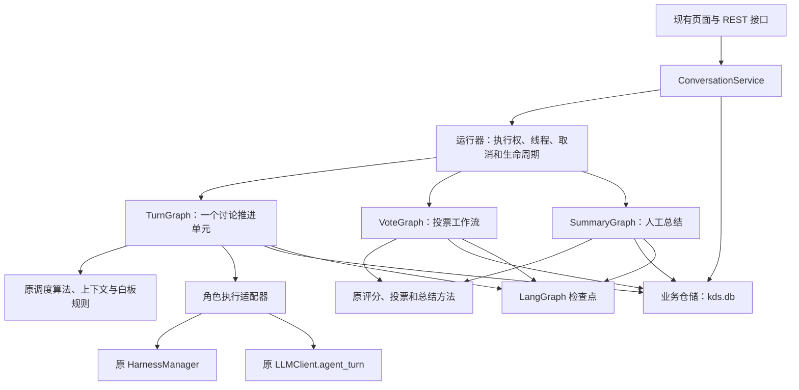
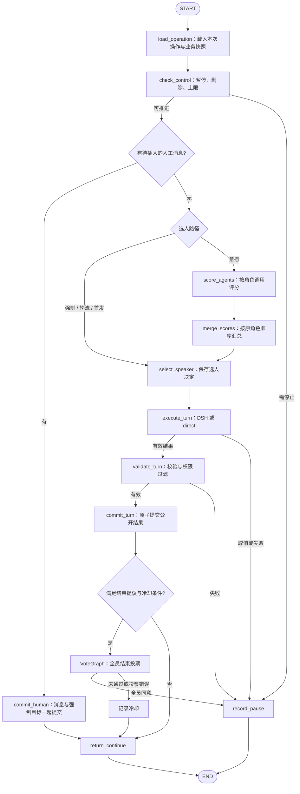

# KDS LangGraph 重构计划

> 编写日期：2026-09-30。代码基线：当前工作区 `main`，提交 `6013612`。
> 本文原始版本是待实施方案；编写时仅新增文档，未修改业务代码、依赖或数据库，也未运行真实模型。2026-09-30 实施前验证已核对当前代码、现有测试和 LangGraph 官方文档，验证结论及边界修订如下。各阶段完成状态由实际实施与测试结果另行记录。

## 0. 实施前验证结论

计划的核心合同与 `app/engine.py`、API、数据库、调度及现有测试基本一致，可以按阶段实施。有限回合图、业务事务与检查点分离、子操作去重和原 DSH 执行器边界均合理；不能仅将旧循环包装成一个节点即宣称完成。

已补充必须明确的实施细节：检查点使用同步持久化；未完成图使用 `invoke(None, config)` 继续；结束投票重启后中断并结算冷却；普通投票在工作线程读取历史时冻结；DSH 用量身份包含每次运行 ID 和 JSON 修正序号。依赖锁版、SQLite saver 线程安全及故障注入仍须以可运行测试验证，文档核对不能替代运行结果。本工作区可用 Python 为 3.13，不能据此单独证明 README 承诺的 Python 3.10+ 兼容性。

文中提到的 `docs/multi-agent-plan.md` 在当前工作区未提供，未能验证其内容；第 12 节只保留原方案中的后续衔接建议，不将缺失文档作为本轮重构前置依赖，也不补造该文档。

## 1. 重构目标与范围

将 KDS 的流程控制迁移到 **LangGraph Graph API**，保持现有多人群聊功能、模型后端、接口和用户操作方式，重点改善流程扩展、并行评分、故障恢复和状态一致性。

推荐分工：**LangGraph 编排回合和辅助工作流；KDS 保留业务规则和对外接口；DSH 继续负责角色回合内部的推理与工具执行。** 不把所有功能改造成新的 Agent，不用一个 LLM supervisor 替换现有发言算法。

本次等价迁移以已经实现的代码为准。原方案引用的 `docs/multi-agent-plan.md` 当前工作区未提供；拓扑画板、父子任务、动态子 Agent、多群聊和全 DSH 辅助调用尚未实现，放在本文第 12 节说明衔接方式，不作为本次切换的前置条件。

迁移完成后应达到：

1. 配置、聊天、人工插话、暂停继续、投票、白板、总结和历史恢复仍按原规则工作。
2. 扩展流程时增加节点、子图或调度策略，不再持续扩大 `ConversationRunner._run()`。
3. 意愿评分及投票可以受控并行；同一群聊的公开发言仍顺序执行。
4. 已保存的调度结果和模型结果可继续使用；恢复时不重复发布发言、应用白板或结算用量。
5. 新旧引擎可以按对话区分，切换与回退有明确边界。

第一阶段继续使用 Flask、原生 JS/CSS、SQLite、同步模型客户端和本地运行方式。暂不引入 FastAPI、React、Redis、Celery、Agent Server 或强制 LangSmith 服务。

## 2. 当前实现与改造判断

| 模块 | 已有实现 | 本次处理 |
| --- | --- | --- |
| `app/engine.py` | `ConversationRunner` 同时管理主循环、调度、状态、锁、计时、人工操作、投票、白板、用量和恢复 | 主要重构对象。拆成工作流、业务服务、运行器和快照适配器；旧实现保留到迁移验收完成 |
| `app/scheduler.py` | `willingness_select()` 的 softmax 采样；`update_heat()` 的热度衰减 | 原算法沿用，增加策略接口，移走引擎里的流程耦合 |
| `app/harness.py` | DSH SDK 适配、角色独立目录、会话复用、取消、工具预算、事件、最终输出校验和格式修正 | 核心实现沿用，调整回调接入、操作标识和运行时生命周期 |
| `app/dsh/bridge.mjs` | DSH 工具限制、预算控制及提示词 overlay | 沿用，重构不改变工具白名单、权限模式及单次变量展开行为 |
| `app/llm.py` | direct 发言、意愿评分、投票、总结、配置助手；OpenAI 兼容接口及 mock | 沿用方法和解析器，由节点调用；重试边界另行收窄 |
| `app/json_repair.py` | 独立 JSON 修正请求及取消，复用 DSH 模型和密钥 | 沿用，不用图级重试代替格式修正 |
| `app/tool_logs.py` | 工具事件归一化、标识、脱敏、截断和摘要 | 沿用；事件持久化移交统一仓储入口 |
| `app/db.py` | `configs`、`conversations` 两张表，主体存 JSON；启动修复残留状态 | 保留业务表和旧 payload，增量加入版本、操作记录与用量去重，另接 LangGraph checkpointer |
| `app/routes/api.py` | REST 接口、配置校验、`RUNNERS` 查找及恢复 | 保留路由、返回格式和主要校验；将具体 Runner 依赖改为服务接口 |
| `app/assistant.py` | 内存多轮配置助手，前端确认后应用 proposal | 首版沿用；持久化助手对话作为独立后续项 |
| `app/static/js/app.js` | 聊天气泡、投票、倒计时、白板、工具日志，每秒轮询 | 首版沿用；后续可增加增量事件传输 |
| `tests/` | 生命周期、调度、解析、白板、投票、DSH、日志及前端回归 | 作为兼容依据；面向公开行为复用，内部字段测试随拆分调整 |

当前最值得处理的问题：

- `_run()` 将选人、执行、提交、结束投票和退出处理连在一起，扩展分支容易影响生命周期。
- `_willingness_choose()`、`_run_end_vote_inline()` 和 `_run_vote_inner()` 都逐角色串行调用，等待时间随人数增加。
- 进程内状态与数据库快照紧密耦合；`to_dict()` 同时服务 API、持久化与恢复。
- `_persist()` 吞掉所有异常；在需要可恢复执行时，不能把未落盘的调度或结果当成已完成。
- `pending_human_message`、`pending_human_target` 没有进入持久化 payload，运行中的预约可能在重启后丢失。
- DSH 通知会反复保存整份对话，消息增长后写入和轮询开销增加。
- 已有锁解决了一部分竞态，但检查点本身不会自动解决重复恢复、迟到回调或两个执行器同时处理同一对话。

## 3. 必须保留的业务语义

以下是验收合同。实现优化可以改变内部结构，不能无说明地改变这些行为。

| 场景 | 保留规则与代码依据 |
| --- | --- |
| 状态与完成 | 对话状态仍为 `running / paused / completed`。只有人工调用 `summarize_now()` 对应的操作能进入 `completed`；达到上限、手动暂停、结束投票通过都只是暂停 |
| 暂停原因 | 保留 `manual / limit / vote_end / error`。异常可恢复；不能把 LangGraph 的 `END` 映射成业务 `completed` |
| 限制 | API 要求至少两个角色，总输出 token 与总时长不能同时无限。恢复要求当前未达到任一上限；到上限先延长 |
| 计时 | 只累计讨论运行的时间，暂停和停机时间不计入。暂停状态下独立投票与总结不重新启动讨论计时 |
| 调度 | 两人强制轮流；三人及以上沿用轮流或意愿模式。保留首发、固定/随机顺序、热度、温度、禁止连说和强制下一位 |
| 轮次 | 现有 `turn` 同时统计人工发言和角色发言；消息 `round` 使用追加前的值。不能改成仅统计 Agent 回合，否则日志定位和冷却会变化 |
| 运行中插话 | 通过 `/reserve` 预约，当前回合结束后在循环入口插入。现状是一个槽位，后一次预约覆盖前一次；首版保持覆盖语义并增加落盘 |
| 暂停中插话 | 立即追加消息并持久化。人工目标在消息真正追加时才生效，只覆盖下一次选人；不能在预约时提前消费 |
| 角色设定可见性 | 沿用 `_build_persona()`：检查“其他角色的设定允许谁看”，支持 id/name/`all`，不是按当前角色的可见列表反向解释 |
| 模型上下文 | 群聊只包含公开消息；DSH 私有工具过程、原始日志不进入其他角色的 `_history()` 或最终总结 |
| 发言后端 | 新对话沿用配置的默认后端；历史缺少 `config.agent_backend` 时按 `direct` 恢复；`LLM_MOCK=true` 不启动 DSH |
| 输出解析 | direct 保留文本兜底；DSH 严格校验结构化结果。权限检查仍由 KDS 执行，不能因为模型返回字段就授权 |
| 白板 | 保留 md/html、人类只读、编辑者名单、增量操作、版本和最后编辑者。发言与其白板修改在下一角色读取前一并提交 |
| 主动结束投票 | 只有授权提议者可触发；所有角色明确同意才暂停为 `vote_end`；弃权不算同意，未通过按现有轮次规则冷却，保留 `kind="end"` |
| 普通投票 | 只在非 running 时发起，当前 API 同时允许 `paused` 和 `completed`；题目、选项、每人多票及重复投同一选项的规则不变 |
| 投票中的操作 | 普通投票进行时拒绝再次投票、继续和总结；暂停态仍可人工插话。投票读取启动时冻结的公开历史，不吸收中途插话 |
| 用量 | 评分、角色发言、投票、总结均计入讨论用量；配置助手仍独立。DSH 已上报的失败尝试、压缩和修正消耗保留，不能只算最终 speech |
| 日志 | 保留最近 200 条、`harness_log_rev`、摘要与 `?tool_logs=1` 正文分离、旧消息按角色名匹配，以及刷新后的展开状态和滚动行为 |
| 重启 | 仍先转为可观察的暂停，不在服务启动时自动继续调用模型；未完成普通投票标为中断错误，用户可重新发起 |

还有三项容易在重构中被“顺手改变”的行为，应单独冻结：

1. **取消能力不同。** DSH 有轮内取消和约 3 秒关闭兜底；direct/评分/投票目前是同步调用，通常要等当前调用返回。兼容阶段保留 direct 当前回合可提交后再暂停的行为，不宣称所有调用都能立即停止。
2. **上限不是严格费用封顶。** 当前循环主要在回合入口检查限制；评分、结束投票等可能令累计值超过阈值。人工总结即使在到限后仍可执行，普通投票也不能因为讨论到限而被无条件禁止。更严格的预算预留属于第 10 节优化。
3. **总结失败也保持完成。** `_finish()` 先标记 `completed`，再尝试总结，失败时保存“总结失败”文案。首版保留该合同及 `/summarize` 的同步响应；“总结失败可重试”另作功能调整。

总结调用中重启的处理也应明确：人工总结操作已被可靠接受时，恢复对账保持完成状态；已有 `result_ready` 只提交保存的总结和用量，不重新调用模型；没有确定结果则保存“总结中断”说明并终止该操作。不能依赖仅存在于内存的 `_summary_in_progress`，也不能在启动时为未完成总结自动产生新模型请求。

## 4. 目标结构与 LangGraph 使用方式

### 4.1 三层职责



- **图层决定下一步做什么。** 选人、评分分支、角色回合、投票、提交及暂停都成为可单独测试的节点。
- **业务层决定什么是合法结果。** 角色权限、预算口径、白板和完成条件仍由普通 Python 代码实现。
- **运行器管理实际执行资源。** Flask 请求线程、对话执行权、DSH 生命周期和取消信号不会因为引入 LangGraph 自动消失。

LangGraph 节点可以直接调用普通 Python 函数，因此无需先把 `LLMClient` 或 DSH 改写为 LangChain 模型、`ToolNode` 或预制 Agent。[官方依据：Graph API](https://docs.langchain.com/oss/python/langgraph/graph-api)

### 4.2 选择有限回合图，避免一个无限 invoke

**首版采用：一个讨论推进单元执行一次 `TurnGraph`，执行到 `END` 后由运行器判断是否再次调度。** 推进单元可能是插入一条人工消息，也可能是一个角色回合及其结束投票。

这样可以在每个单元之间稳定处理暂停、恢复和资源释放，不把无限群聊绑到一次超长图调用上。运行器只负责“执行一个单元、读取 outcome、继续或释放资源”；调度和业务分支必须放在图中，不能仅将旧 `_run()` 整体包装成一个节点。

- `outcome` 使用 `continue / paused / completed / error` 等内部结果；它与 LangGraph 运行结束分开。
- 同一对话复用 `thread_id="conversation:<id>"`，每个推进单元有单独且持久化的 `operation_id`。
- 一个 thread 同时只允许一个 invoke/stream；新单元开始前重置临时评分、临时结果和路由字段。对带合并 reducer 的字段不能靠传 `{}` 清空：由单独初始化节点使用经版本验证的 `Overwrite({})`，或定义明确的 reset 更新；该步骤不与评分分支并发执行。恢复同一 operation 时不得清空已完成分支。
- 每次调用显式配置足够覆盖有限路径的 `recursion_limit`，防止错误接线。该值限制图的 super-step，不是用户可发言的轮数。
- 首版 invoke/stream 显式使用 `durability="sync"`，在下一节点开始前完成检查点写入；`async` 存在崩溃时丢失最近检查点的窗口，`exit` 不满足单元内部恢复要求。版本锁定后验证该调用参数，不依赖默认值。[官方依据：Durability modes](https://docs.langchain.com/oss/python/langgraph/checkpointers#durability-modes)
- 不在每个 `END` 都关闭 Harness；只有业务暂停、删除、完成或故障退出才清理，从而保留正常连聊时的角色会话复用。

首版保留每个活动对话一个后台工作线程，优先降低迁移变量；后续再将这个薄运行器切换成有界执行池。LangGraph 的流程调度和操作系统线程调度是两个层面。

### 4.3 各项 LangGraph 能力的落点

| 能力 | KDS 用途 | 边界 |
| --- | --- | --- |
| `StateGraph`、条件边 | 将回合各阶段显式连接，按调度模式、结果和控制状态路由 | 不让模型自行决定权限或完成状态 |
| `Send` | 按角色数动态分发评分/投票任务 | 群聊正式发言不并行 |
| reducer | 汇合各角色评分和票据 | 用按业务键去重的映射，不能对所有字段简单列表相加 |
| checkpointer | 保存节点进度、选人结果和已完成分支 | 不保存进程，不保证外部工具恰好执行一次 |
| 子图 | 共用投票流程，后续增加审查、任务分派等流程 | 明确输入输出，不共享整个 Runner 对象 |
| `RetryPolicy` | 对经过分类的临时故障做有限重试 | DSH 整轮和写操作默认不自动重跑 |
| `stream` 的 `updates/custom` | 内部阶段观察，以及把 DSH 进度转换成既有状态/日志 | 不将原始 graph state 直接发到浏览器 |
| `interrupt()`、`Command(resume=...)` | 后续真正需要“等待人工决定”的节点 | 当前暂停按钮首先是取消/停止推进，不能靠 interrupt 中断正在阻塞的 SDK |

并行、重试和并发配置依据见 [Graph API 实用指南](https://docs.langchain.com/oss/python/langgraph/use-graph-api)；子图边界依据见 [Subgraphs](https://docs.langchain.com/oss/python/langgraph/use-subgraphs)。

## 5. 回合图与调度改造

### 5.1 节点与边



具体职责：

| 节点 | 从现有代码提取的内容 | 必须满足 |
| --- | --- | --- |
| `load_operation` | 初始化/恢复回合输入 | 新操作初始化临时字段；恢复旧操作使用已冻结输入 |
| `check_control` | `_interrupt_requested`、`_limit_reached()`、状态检查 | 读取运行器的最新控制状态，不能只读旧检查点中的标志 |
| `commit_human` | `_run()` 人工消息分支、`human_say()` | 追加消息、增加 turn、设置目标和消费预约在同一事务中完成 |
| `score_agents` | `_willingness_choose()` 的逐角色调用部分 | 同一轮使用同一份历史和同一 turn；第一阶段可串行，之后换 `Send` |
| `merge_scores` | 评分整理和用量关联 | 结果按 agent id 归并，再按原 agents 顺序展示及传给算法 |
| `select_speaker` | 强制目标、轮流、首发、`willingness_select()` | 每个 operation 只形成一个选人决定，调用模型前落盘 |
| `execute_turn` | `harness.run_turn()` / `llm.agent_turn()` | 使用既有结构化输出；失败与取消保留已知用量 |
| `validate_turn` | 提议者/编辑者检查、结果规范化 | 无权限操作被过滤；DSH 格式修正仍发生在原 Harness 内 |
| `commit_turn` | 消息、白板、heat、last speaker、turn、harness cursor 的更新 | 一个业务事务提交，重复进入不重复应用 |
| `VoteGraph` | `_run_end_vote_inline()` | 冻结历史、记录全员票据、判断一致同意；不直接标记 completed |
| `record_pause` | `_pause_segment()` 和异常出口 | 保存原因、计时和待恢复角色，通知运行器清理资源 |

图中控制路径优先使用条件边；确实需要一次更新状态并跳转时才用 `Command`。同一分支出口不能再挂冲突的普通边，否则可能同时执行两条路径。[官方依据：Command 与静态边](https://docs.langchain.com/oss/python/langgraph/graph-api#command)

### 5.2 发言策略沿用，评分编排替换

新增小型 `SchedulingPolicy` 接口，至少区分“需要哪些评分”和“如何选下一位”。实现 `RoundRobinPolicy`、`WillingnessPolicy`，共用如下优先级：

1. 已生效的 `forced_next_idx`，包括人工指定或中断回合保留的角色；消费一次。
2. 轮流模式按已保存顺序和游标选人；两人强制走此路径。
3. 意愿模式在现有 `turn == 0` 条件下使用 `first_idx`，其余回合评分后采样。

沿用 `s_eff = (score - lam × heat) / tau`、数值稳定 softmax 和 `heat = gamma × heat + 本轮发言增量`。保留 `lam/tau/gamma/forbid_consecutive` 的输入校验。

选人带有随机性，必须把随机首发、轮流顺序以及每次选人结果保存下来。为每个选人操作保存固定 seed 或 RNG 状态，再保存最终 `agent_id` 和游标决定；检查点重放不能重新随机选出另一人。DSH 中断时仍保留该角色以供继续，暂停后新增的人工指定可以按原规则覆盖下一位。

轮流游标按原规则在选人时消费一次，并与选择记录一起落盘；重放同一选择或重试保留角色不能再推进游标。人工强制选人不消费轮流游标；heat、last speaker、turn 则只在公开发言成功提交时更新。不要将所有调度状态一律推迟到成功提交，造成取消后重复轮到同一位。

角色数量变化不需要生成 N 套图定义：使用通用 `score_agent` 和 `execute_turn` 节点，角色差异由输入参数表达。未来新增策略只扩展策略注册和相应节点，不修改角色执行器。

### 5.3 并行评分与投票

第二阶段以后将评分变成 `prepare_batch → Send(score_agent, ...) × N → collect_batch`，投票采用同一模式。

- 分发前冻结 `batch_id`、角色列表、历史游标、persona、turn 和题目；所有分支使用同一输入版本。
- 每个分支返回 `{batch_id, agent_id, result, operation_id}`。reducer 按 `(batch_id, agent_id)` 合并；相同键、相同结果可重复，冲突结果应报错，不能按完成顺序随意覆盖。
- 分支直接上报独立的用量事件；公开评分列表和票数由汇合节点整理。已成功调用的消耗不能因另一个分支失败而消失。
- 明确当前批次应有多少个角色结果，收齐后只汇合一次；不能把“目前没有更多结果”当成所有角色已完成。首版分支保持单层同长度，复杂子图另加显式汇合门槛。
- `max_concurrency` 放在调用 config 顶层；另外为所有对话共享一个模型请求限流器，避免每个图各自限流但总请求失控。
- 先用并发 1 验证等价，再用可配置的小并发量（例如 3）验证乱序返回、异常和取消。并行减少等待，不减少调用次数或 token。
- 评分缺失不能偷偷用默认分数继续选人；原解析器对畸形文本返回默认分数的行为保留，但网络调用失败仍走明确错误分支。投票失败仍记录错误，不能判为同意结束。

LangGraph 可保存同一 super-step 中成功分支的 pending writes，恢复时不必重新执行这些成功分支；外部模型调用和数据库副作用仍需要下节的业务幂等记录。[官方依据：Checkpointers](https://docs.langchain.com/oss/python/langgraph/checkpointers)

## 6. 状态、持久化与恢复

### 6.1 区分业务事实、流程进度和运行时对象

不把整个 `ConversationRunner.__dict__` 放进 graph state，也不让数据库 payload 和图状态各自维护一套可写的完整对话。

| 状态类别 | 保存位置 | 内容与规则 |
| --- | --- | --- |
| 业务事实 | `data/kds.db` | 现有配置、消息、白板、用量、投票、对话状态、调度游标和预约；通过统一仓储提交 |
| 工作流进度 | LangGraph checkpointer | 当前 operation、阶段、输入版本、评分/票据结果、选人、结果引用、outcome、graph/schema version |
| 操作与用量记录 | `data/kds.db` 新增表 | 确认哪些请求已接受、哪些调用已有结果、哪些业务效果已提交及哪些用量已计入 |
| 临时运行时 | 进程内运行器及 runtime context | `LLMClient`、`HarnessManager`、锁、线程、取消 Event、连接、单调时钟；不序列化 |
| API 快照 | `snapshot.py` 从业务事实生成 | 保持现有字段和脱敏；可以附加诊断字段，不能直接返回全量内部状态 |

建议 `TurnState` 至少包含：

```python
class TurnState(TypedDict, total=False):
    conversation_id: str
    operation_id: str
    schema_version: int
    graph_version: str
    runner_epoch: int
    input_snapshot_ref: str
    history_cursor: int
    base_whiteboard_rev: int
    phase: str
    score_batch_id: str
    scores_by_agent: Annotated[dict[str, dict], merge_scores_by_key]
    selected_agent_id: str | None
    turn_result_ref: str | None
    vote_id: str | None
    outcome: str | None
    error: dict | None
```

这是字段示意，`merge_scores_by_key` 为待实现的纯函数。输入快照保存在 operation 中，包含可复现该次调用的配置版本、公开历史边界及相关白板版本；历史正文首版仍从原 payload 读取，不必马上新建消息表。并行分支只接收本角色需要的 prompt 和上下文，不能接收所有角色的私密设定。

业务用量以唯一用量事件为准；图中的累计数只能作为读取快照或展示缓存。恢复时不能用旧 checkpoint 的累计值覆盖较新的失败/取消用量。运行时依赖通过 `context_schema`/runtime context 注入。[官方依据：Runtime context](https://docs.langchain.com/oss/python/langgraph/graph-api#runtime-context)

### 6.2 SQLite 的最小增量改动

保留现有两张表，增加以下记录，不在首版整体改用 ORM：

| 新增项 | 最少字段 | 用途 |
| --- | --- | --- |
| 对话版本 | `state_rev` 列；payload 中 `orchestration_backend`、`schema_version`、`graph_version`、`runner_epoch` | 识别运行路径、CAS 更新和迟到回调；`agent_backend` 仍单独表示 direct/dsh |
| `orchestration_commands` | `command_id`、`conversation_id`、`kind`、`payload`、`status`、时间 | 人工命令落盘、预约恢复；已被新预约覆盖的命令记为 superseded |
| `orchestration_operations` | `operation_id` 唯一键、`parent_operation_id`、`conversation_id`、`kind`、`status`、输入/选人/结果、提交版本 | 记录逻辑操作；状态可区分 prepared/running/result_ready/committed/uncertain/abandoned |
| `orchestration_attempts` | `attempt_id` 唯一键、`operation_id`、`runner_epoch`、状态、已知结果/错误、时间 | 每次真实外部调用追加一条；重试不能覆盖失败或不确定尝试的记录 |
| `usage_events` | `event_id` 唯一键、conversation/operation/attempt、来源、prompt/completion token | 按事件结算一次，失败、取消和重放不丢账、不重复加账 |
| 检查点文件 | 建议 `data/langgraph_checkpoints.db`，使用独立包 `langgraph-checkpoint-sqlite` | 由官方 saver 管理自己的表；不让 `db.py` 猜测或手改内部结构 |

选择独立文件便于沿用旧业务库，但**两份 SQLite 之间没有自动的原子事务**。采用“业务结果先可靠提交，图重入时用 operation 记录消除重复”的协议，不宣称 checkpointer 与业务表天然一致。

一个讨论推进单元有根 operation，各次评分、角色执行、投票票据和总结有稳定的子 operation（例如根 ID + 用途 + agent ID）；重放沿用子 ID，真实重试新建 attempt。业务结果按 operation 去重，消耗按 attempt 内事件去重，两者不能共用一个简单的“是否已执行”标记。

根 operation 负责整个推进单元，子 operation 负责某个业务效果，两者完成状态分开。角色发言提交成功只完成对应的 turn 子操作；如果还有结束投票，根操作仍是进行中。只有投票/冷却等后续步骤结算完毕，到 `return_continue` 或 `record_pause` 时，根操作才完成；恢复不能因为消息已经发布就跳过结束投票。

- 所有业务写经仓储服务执行，使用短事务；模型请求期间不得持数据库写锁。
- 对话内以短时互斥/CAS 保证提交一致，但调用模型时释放锁。CAS 失败应重新读取最新记录、验证并重算本次 patch，不能用陈旧完整快照覆盖预约、用量或人工消息。
- 新回合提交同时检查消息边界、白板版本和执行代次。单纯的 `state_rev` 改变可能只是用量通知，不能把它误判为对话内容冲突。
- SQLite 连接由明确的服务生命周期管理；确认所选 saver 的多线程用法，统一写入锁、超时及 WAL 设置。`check_same_thread=False` 不代表所有并发写都安全。
- 单机测试使用 `InMemorySaver` 或临时文件；重启恢复测试必须使用文件型 saver。大规模多进程部署再迁移到 Postgres，不把 SQLite 描述成分布式执行协调器。[官方依据：Persistence](https://docs.langchain.com/oss/python/langgraph/persistence)

### 6.3 一次回合的提交协议

1. 运行器取得对话执行权，生成并落盘 `operation_id`。选人节点保存选择、输入快照和调度游标决定，才允许外部调用。
2. DSH 调用前仍保存 `pending=True`；将回调接到仓储和进度适配器，代替直接修改 Runner 属性。
3. 用量通知按独立事件键落盘，并在同一业务事务中更新累计。DSH 事件键包含 `run_id/session_id/seq`，不能只用 `session_id/seq`，因为正常跨回合复用会话时事件序号可能重新开始。JSON 修正使用同一运行/会话标识加独立修正序号。`on_usage(delta)` 增加 `_event_id` 元数据，原三个 token 数字和返回的汇总 usage 保持兼容；重放沿用已保存事件身份，新的真实调用使用新的 attempt/运行身份。
4. 有效最终结果先保存为 `result_ready`。若检查点尚未来得及写入就崩溃，再进入执行节点时从该记录返回结果，不再次请求模型。
5. `commit_turn` 在一个 `kds.db` 事务里提交消息、白板、heat、turn、last speaker、DSH history cursor 和 turn 子操作的 committed 标志；同时按提议权限与冷却条件保存后续结束投票待办及稳定 vote ID。direct 的已报告用量也需在此前/同事务记入唯一事件；DSH 返回汇总只能核对，不能重复累计。
6. 图检查点保存提交结果；如果业务事务已成功而检查点落后，重入节点查到 turn 子操作 committed 后返回原提交结果，跳过所有追加/修改，但仍按根操作的待办进入结束投票或收尾。冷却截止轮次用该次投票冻结的 turn 计算并幂等写入。
7. 只有收到最新有效代次结果才继续下一回合。取消后迟到的用量仍记账；已经废弃的发言和白板结果不能重新发布。

白板 `append/prepend` 天然会在重复执行时重复内容，因此幂等必须覆盖整个回合提交，不能仅给聊天消息去重。投票票据、总结和人工插话同样以稳定的业务键提交。

**不确定窗口仍然存在：** 外部模型或工具已执行，但程序在保存结果前崩溃时，LangGraph 无法证明外部效果是否发生。该 attempt 标为 uncertain；保留日志、工作目录与已报告用量，不在启动时自动回放工具。兼容 checkpoint 仍在且用户明确点击继续时，可以废弃旧根及旧 turn 操作，将原角色保留给新的 operation，再按现有 DSH 规则新建会话并重新组织回合；轮流游标不重复推进。这可能再次调用工具，不能承诺外部副作用恰好一次。丢失 checkpoint、图版本不兼容或已知关键用量/进度记录保存失败时仍拒绝透明重放，需要先对账或通过人工插话开始新回合。

业务关键写入失败应阻止继续派发，并在内存中暴露暂停错误、记录本地诊断；数据库恢复后完成对账。不能沿用 `_persist()` 全部吞异常后继续执行。非关键进度提示可以降级，这是有意的可靠性改进。

### 6.4 重启与恢复流程

1. 启动扫描业务状态，执行现有 stale-running 修复；对新引擎还要识别未完成 operation、执行代次和检查点。
2. 记录暂停状态，冻结已持久化的活动时长；不把停机期间墙钟差加进讨论时长。崩溃前尚未落盘的时间只能做到有界近似，可用轻量运行心跳缩小误差。
3. 人工继续时先检查最新业务上限、投票/总结互斥和删除状态，再取得新的执行权。
4. 若存在安全可恢复的未完成图步骤，使用原 thread/checkpoint 并调用 `graph.invoke(None, config)` 继续，保留已完成分支；若图已在 `END`，传入新 operation 开始下一个单元并初始化临时字段。新的非空输入表示新调用，不能用它覆盖未完成 operation 并冒充恢复。`Command(resume=...)` 只用于对应的人工 interrupt，不用于所有恢复。
5. 对输入仍适用的 `result_ready`，显式将已保存结果接管给新执行代次后提交；committed 子操作返回既有输出，根图继续尚未结算的后续步骤，只有根操作已完成才能直接开始下一单元。接管已持久化结果与接收旧进程的迟到回调不同，后者因 epoch 不符不得发布，已知消耗仍可登记。
6. 普通投票重启后保持原“中断错误、可重新发起”行为，不自动投完；结束投票同样标记中断错误，不恢复后补齐剩余票。若提议回合已提交，按该投票冻结的 turn 幂等结算冷却，再结束根 operation；部分票不能当作全员同意。已完整持久化的结束投票可以直接结算既有 agreed 结果。进一步支持中断投票续跑可作为后续功能。
7. 不将 LangGraph 检查点等同于 DSH session。当前 SDK 仍是新 session + 公开历史 + 最多 8 条、每条 2,000 字符的工具摘录，原始日志/文件保留，不能称为私有上下文无损恢复。

检查点文件丢失或 graph version 不兼容时，完成态仍能读业务历史；暂停态只有在操作已对账、处于安全边界时才能从业务快照重建图输入。其余情况显式暂停，不能默默从头再执行。

**人工改动优先于旧回合输入。** 暂停后新增人工消息、指定目标或改变影响当前调用的配置时，服务须先对账：已 committed 的回合不改写；未提交且输入已过时的回合标为 abandoned，保留用量，从最新状态创建新单元。恢复未结束的旧图时，各节点的共用守卫读取最新 operation 状态，abandoned 分支只做无副作用收尾后到 `END`，不能跳过入口校验继续执行旧模型请求。并行分支以取消结果收齐后退出，不将缺失结果当成有效评分。上限仅被放宽、用量或日志版本变化不等同于历史输入过时。

版本迁移优先在图已到 `END` 的边界执行。保存着待运行节点的 checkpoint 继续使用其原 graph version，或先显式终止并完成业务对账；不可直接重命名/删除待恢复节点再用新图接管。新 schema 字段给出默认值，改名和类型变化提供转换函数。

## 7. 人工控制、投票、总结与错误处理

### 7.1 对外操作保持兼容

| 现有接口 | 新内部处理 | 对外行为 |
| --- | --- | --- |
| `POST /api/conversations` | 服务创建业务记录、固定 backend/version、启动 TurnGraph 运行器 | 保留 201 和初始快照 |
| `GET /api/conversations/<id>` | 从快照服务读取业务状态，合并有限运行时进度 | 字段、日志摘要/正文参数兼容 |
| `POST .../reserve` | 命令入库；运行时更新单槽预约，暂停时短事务直接插入 | 保留 `reserved/appended` 和下一位目标语义 |
| `POST .../interrupt` | 登记停止请求并设置取消信号，DSH watcher 协作退出 | 仍异步停止，返回原 `ok` |
| `POST .../resume` | 校验上限、互斥和执行权，恢复或新建推进单元 | 保留成功/409 合同；并发请求不能启动两份图 |
| `POST .../limits` | 暂停状态下修改业务上限 | 仍要求新上限大于消耗且不能同时无限 |
| `POST .../votes` | 注册投票并启动 VoteGraph | 保留 202；允许 paused/completed，投票不改变对话终态 |
| `POST .../summarize` | 取得总结执行权，调用 SummaryGraph | 保留仅暂停时可用、同步返回和完成规则 |
| `DELETE .../<id>` | 先设删除标记/失效代次，停止活动工作，再清理业务及该对话检查点 | 保留删除效果；迟到回调不能复活记录 |
| `/api/configs*`、`/api/assistant/chat` | 继续原校验、CRUD 与助手 | 首版无交互变化 |

### 7.2 普通投票与结束投票复用同一个图

`VoteGraph` 输入为 `vote_id/kind/agents/history_snapshot/question/options/votes_per_person`，输出为票据、票数、错误及可选 `agreed`。

- 两种投票入口共享 VoteGraph 节点实现。实施选择普通投票和结束投票都使用独立 `thread_id="conversation:<id>:vote:<vote_id>"`；结束投票以 `parent_operation_id` 和稳定 vote ID 关联 TurnGraph 根操作，父节点同步等待投票结果，根操作保持未完成直到投票/冷却结算。与原建议“继承父图检查点命名空间的子图”相比，这是检查点组织方式的明确调整：单独的票据检查点由业务操作账本与父待办对账，业务规则及串行发言语义不变，不依赖未验证的自定义命名空间恢复行为。
- 服务持有业务操作互斥，禁止投票期间启动讨论、总结或第二次投票。独立 thread 不是绕过互斥的理由。
- 暂停态人工插话属于短事务，允许与普通投票重叠；票据提交只修改对应 vote 和用量，不能拿投票启动时的完整 payload 覆盖后来插入的消息。
- 普通投票的历史冻结时点沿用当前 `_run_vote_inner()`：工作线程开始执行、首次模型调用前持锁读取公开历史，之后所有角色使用同一份文本。`start_vote()` 接受请求与该时点之间追加的人工消息可以进入投票；冻结以后追加的消息不进入本次投票。测试应以工作线程的冻结点建立同步屏障。
- 结束投票是角色回合的后续步骤；投票结束前不让下一角色发言。全部同意只设置 `paused(vote_end)`。
- 保留逐票展示能力：票据先按角色键持久化，快照按 agents 顺序输出；进度事件不依赖 graph super-step 已整体提交。

### 7.3 总结图

`SummaryGraph` 使用 `load_public_log → generate_summary → commit_summary`，由人工操作单独启动，使用独立操作 ID 和总结互斥。

保留原提示词、1200 token 请求上限、空日志文案、异常文案以及用量口径。只有这个人工入口可以写 `completed`。内部可先记录 `summary_in_progress`，但不增加前端必须理解的新业务状态。

人工总结开始时就按原实现持久化 `completed` 和总结 operation。若此后服务崩溃，启动恢复只对账已保存的总结结果；无确定结果时保留完成态并给出“总结中断”说明，不自动再次收费调用，也不把对话退回 running。若日后需要重试总结，新增明确的产品入口。

### 7.4 interrupt 的适用边界

现有用户暂停首先停止当前/后续工作，因此首版通过取消信号加 `record_pause → END` 实现。后续增加“批准某项操作”“确认草稿”等必须等用户选择的流程时，再新增专用 `await_human` 节点，使用 `interrupt()` 持久化等待，以原 thread 的 `Command(resume=...)` 继续。

恢复会从发生 interrupt 的节点开头重新运行，所以该节点之前的副作用必须幂等，最好将外部操作单独放在后续节点。不要用宽泛异常捕获吞掉 interrupt，也不要把它当成杀掉阻塞线程的机制。[官方依据：Interrupts](https://docs.langchain.com/oss/python/langgraph/interrupts)

### 7.5 错误与重试分类

| 情况 | 首版处理 | 可选优化 |
| --- | --- | --- |
| 用户取消、删除、达到讨论上限 | 不重试，保留已知用量，按控制状态退出 | direct/辅助调用增加可取消传输层 |
| DSH 步骤/工具/回合预算或超时 | 保持现有错误说明与暂停；保留待继续角色 | 不把限额错误视为临时网络错误 |
| 非空且未截断的 DSH 最终 JSON 格式错误 | 原本地校验 + 最多两次修正，共享预算 | 不重新执行 DSH 调查/工具 |
| 空输出、已知截断、权限错误、非法配置 | 不做泛化重试 | 提升定位信息 |
| 评分/投票临时网络或限流失败 | 先保持现有错误路径 | 明确异常分类后启用有限 `RetryPolicy`，已成功分支复用 |
| DSH 整轮失败、结果不确定 | 不设置通用图级自动重试 | 用户继续时新 attempt，保留副作用不确定标记 |
| 业务结果提交失败 | 中止新工作、保留 result_ready 供对账 | 只重试幂等数据库提交，不重跑模型 |

`LLMClient._call()` 原实现对任何 JSON-mode 异常都去掉 `response_format` 再请求。迁移时有意收窄：只有供应商返回 400/422，且错误明确声明不支持 `response_format`/JSON mode 参数或模式，才允许一次无该参数的降级请求；普通 429、超时、连接故障、认证失败和无关参数校验直接交给原错误路径。与 OpenAI SDK 内部重试、JSON 修正及 LangGraph 重试一起核对，避免多层重试成倍放大请求。所有已上报的额外请求消耗都须入账。

## 8. DSH、事件与前端复用

### 8.1 DSH 适配只改边界

引入 `AgentTurnExecutor` 协议，用 `DirectTurnExecutor` 和 `HarnessTurnExecutor` 封装现有调用；统一返回经过校验的 `TurnResult`，包括 speech、提议、白板操作、usage 及可选 harness cursor。

- `HarnessManager.run_turn()` 仍负责工具循环，不将其步骤再拆成 LangGraph `ToolNode` 循环，避免两个系统同时控制工具次数和预算。
- 保留角色独立 home/workspace、会话增量历史、工具资料摘录、取消文件和清理兜底。
- `on_usage` 接用量仓储，`on_progress` 接日志仓储及进度适配器；回调携带 conversation/operation/attempt/epoch，不能只靠当前 `turn` 推断归属。
- 日志展示继续使用现有 run + step + call 身份；新增 operation 关联可用于恢复，但不能破坏旧日志 ID。
- `DSH_BASE_URL`、`DSH_JSON_BASE_URL`、`LLM_BASE_URL` 的独立性、工具权限和敏感信息遮盖保持不变。
- 不把 SDK 升级和 LangGraph 迁移绑在一起；保留 `deepseek-harness-sdk==0.1.5rc1`，兼容版本验证单独完成。

### 8.2 保留轮询，先建立事件适配层

首版继续每秒 GET 快照。运行器可以消费 LangGraph 的 `updates/custom`，转换为既有 `harness_activity`、日志、消息和投票状态，前端无需了解节点名或图协议。

DSH 和当前 OpenAI 原生客户端不会自动变成 LangChain 的 token 事件来源；需要自行桥接 progress。SDK 回调可能来自其他线程，应通过线程安全队列转发，不能假定那里能直接取得 LangGraph 的当前执行上下文。[官方依据：Streaming 与任意模型接入](https://docs.langchain.com/oss/python/langgraph/streaming)

后续增量事件/SSE 再新增稳定事件序号、断线补发和 GET 对账；LangGraph 的运行时 stream 本身不等于持久化事件队列。

工具日志继续按现有规则脱敏、截断、HTML 转义及按需获取，且不暴露推理过程。不得直接将 `values/debug` 流传给前端：图内部状态可能含角色设定、输入快照和私有资料。前端保留日志展开状态、焦点、滚动和倒计时的已有实现。

## 9. 文件级实施清单

建议结构如下；为控制首版规模，相关服务可以先放在较少文件中，但职责不能再回流到巨型 Runner。

```text
app/
  engine.py                      # 过渡期保留旧 ConversationRunner
  services/
    conversations.py             # 统一生命周期和人工命令入口
  orchestration/
    state.py                     # 图状态、输入输出和 reducer
    turn_graph.py                # 有限回合图
    vote_graph.py                # 普通/结束投票共用图
    summary_graph.py             # 人工总结图
    nodes.py                     # 初期节点实现，增长后按功能拆分
    runtime.py                   # 图执行、执行权、取消与资源清理
    policies.py                  # 轮流/意愿策略，调用 scheduler.py
    backends.py                  # 现有 DSH/direct 的薄适配
    checkpointer.py              # saver 生命周期及清理
  domain/
    context.py                   # persona、system、history、vote prompt
    whiteboard.py                # 白板操作与权限规则
    snapshot.py                  # 业务状态到旧 API payload
  repositories/
    orchestration.py             # command/operation/usage 与原子提交
  migrations/
    langgraph_v1.py              # 可重复执行的增量建表/补字段
```

| 原文件 | 明确改动 | 沿用部分 |
| --- | --- | --- |
| `app/engine.py` | 提取 `_build_*`、白板、状态映射；旧 Runner 留作 legacy 路径 | 首版不删除旧数据恢复能力 |
| `app/routes/api.py` | `_load_runner` 等改为 service 查找；增加编排后端选择入口 | URL、错误状态码、参数校验、响应合同 |
| `app/db.py` | 版本字段、新表迁移、短事务仓储支持；启动修复按编排版本区分 | 配置 CRUD、历史列表、旧 JSON 数据 |
| `app/__init__.py` | 初始化迁移、checkpointer 服务与恢复扫描 | Flask 工厂、模板/静态资源和现有启动方式 |
| `app/config.py` | 增加编排后端、检查点路径和评分/投票并发配置 | 所有已有 LLM/DSH 配置 |
| `requirements.txt` | 增加已验证并锁定版本的 `langgraph` 与 `langgraph-checkpoint-sqlite` | 当前 Python Web/模型依赖；无须仅为图引入 `langchain-openai` |
| `requirements-dsh.txt` | 继续继承基础依赖，验证兼容 | DSH SDK 固定版本 |
| `app/harness.py` | 回调附带稳定事件/操作身份，支持新仓储及运行器 | 模型调用、JSON 修正、工具、取消和隔离实现 |
| `app/llm.py` | 接入调用结果/用量封装；后续收窄 JSON-mode fallback | 各用途 prompt、解析、mock 和 OpenAI 兼容调用 |
| `app/scheduler.py` | 第一阶段不改算法 | 两个纯函数与现有测试 |
| `app/assistant.py` | 第一阶段不改 | proposal 的人工确认流程 |
| 前端三个文件 | 首版只在兼容缺口时最小调整 | 页面结构、聊天、投票、白板、日志、倒计时 |
| `README.md`、`CLAUDE.md`、环境变量示例 | 实施后更新架构、启动、恢复及测试说明 | 中文文案和既有 DSH 限制说明 |

新增配置建议：`ORCHESTRATION_BACKEND=legacy|langgraph`、`LANGGRAPH_CHECKPOINT_DB`、`SCORE_CONCURRENCY`、`VOTE_CONCURRENCY`、`LLM_GLOBAL_CONCURRENCY`。这是建议名；实施时统一命名并验证数值，不要与 `AGENT_BACKEND=direct|dsh` 混用。

## 10. 优化优先级与不顺带改动的部分

| 优先级 | 优化 | 价值 | 对现有行为的影响 |
| --- | --- | --- | --- |
| 必做 | 显式节点、策略接口、独立状态/快照 | 扩展与测试不再依赖大循环 | 无业务变化 |
| 必做 | 操作记录、幂等提交、用量事件 | 崩溃后避免重复消息、白板和账单累计 | 提高恢复可靠性；不承诺外部工具一次执行 |
| 必做 | 预约与命令落盘、epoch 防迟到提交 | 减少重启丢插话、重复恢复和删除后写回 | 单槽覆盖规则不变 |
| 必做 | 关键持久化失败停止推进 | 防止界面与恢复状态分叉 | 异常处理比原实现严格，应在说明中列明 |
| 优先 | 并行评分/投票、共享限流 | 降低多人等待时间 | 顺序稳定，时延/限流特征改变；先并发 1 对齐 |
| 优先 | 结果复用、分支级有限重试 | 减少故障后已成功请求的重复 | 需计入额外消耗，不能对 DSH 整轮泛化启用 |
| 后续 | 用量预留、每阶段预算检查 | 减少并行时超出剩余预算 | 会改变当前到限边界；单独模式/阶段验收 |
| 后续 | 工具日志与消息分表、批量进度更新 | 减少大 JSON 高频重写 | 保留旧 API 投影和中断用量可靠性 |
| 后续 | SSE/增量历史 | 降低每秒拉取完整对话开销 | 需断线恢复，不要求首版前端迁移 |
| 后续 | 配置助手独立图和持久化 session | 刷新/重启后继续助手会话 | proposal 仍需前端确认，不能接入后自动应用 |
| 后续 | 节点耗时、失败率、队列等待观测 | 找出实际瓶颈 | 本地指标先行，外部 tracing 默认不启用 |

预算优化实施时需要先保留一个兼容模式：评分/投票按原规则完成既有批次，统计所有已知消耗；严格模式再在派发前按请求上限预留并在结算后释放差额。额度不足时明确暂停或不给新分支派发，不能让缺票的结束投票误通过。DSH 未上报的消耗和压缩导致的超额仍无法精确预留。

暂不更换调度数学算法、角色 prompt、群聊上下文策略或白板协议；暂不增加消息压缩、向量记忆、评分跨轮缓存和 AI 主持人。这些会改变讨论结果或权限边界，不能混在“功能相同”的框架迁移里。DSH 自身已有压缩行为照旧。

## 11. 迁移阶段、验证与回退

### P0：冻结合同并验证依赖

- [ ] 整理第 3 节合同及现有测试，记录兼容场景快照；冻结随机源和假时钟。
- [ ] 验证目标 Python 版本和 DSH 固定 SDK 与 LangGraph 的依赖兼容，记录精确版本。README 当前承诺 Python 3.10+，不能无说明地提高最低版本。
- [ ] 用临时目录完成一个最小 StateGraph：同步节点、SQLite checkpoint、Send/reducer、重启恢复、custom 事件及失败分支复用。
- [ ] 验证 saver 的多线程访问、关闭和删除 thread 能力，确定 API 后再写适配；不同文档版本的 stream 输出格式不能混用。

**出口：** 明确锁定依赖和小范围可运行样例，未更改真实讨论数据。本计划没有实际安装验证，因此不填未经测试的精确版本号。

### P1：先抽业务规则，保持 legacy 可运行

- [ ] 提取上下文、白板、快照和调度策略接口，旧 Runner 调用这些函数。
- [ ] 引入 `ConversationService`，路由不再直接依赖具体类；测试保留必要的兼容 facade。
- [ ] 添加 schema migration、command/operation/attempt/usage 仓储和事务接口；旧记录可继续读取。
- [ ] 让同版本的 legacy 适配器也能导入、持久化并确认消费预约命令，避免编排切换两侧只有一侧能恢复人工预约。

**出口：** 旧引擎的用户行为回归通过，仍可独立启动；重构提取本身不改变模型请求内容。

### P2：完成串行 LangGraph 等价路径

- [ ] 实现 TurnGraph、VoteGraph、SummaryGraph，评分/投票并发先为 1。
- [ ] 接入 DSH/direct/mock，保留暂停、预算、人工目标、白板及日志行为。
- [ ] 明确独立普通投票与人工插话的并发规则；同一对话禁止重入。
- [ ] 以对话级 `orchestration_backend` 灰度选择，默认保持 legacy。

**出口：** 使用相同脚本化模型返回值，两个引擎得到相同公开消息、选人顺序、白板、投票、状态与用量；不以真实随机生成文字逐字一致作为标准。

### P3：完成持久化与故障恢复

- [ ] 接入文件 checkpointer，完成 result_ready/committed 协议及用量去重。
- [ ] 对模型返回前后、业务提交前后、checkpoint 写入前后注入崩溃。
- [ ] 覆盖数据库写失败、重复通知、暂停后的迟到输出、重复 resume、删除中执行及跨重启时间统计。
- [ ] 新引擎缺失/损坏 checkpoint 时只能在安全边界重建，未确定的回合不得自动重跑工具。

**出口：** 可以从有用的最近进度恢复；每个操作最多发布一次业务结果，已知消耗不丢失。

### P4：启用并行和必要的性能优化

- [ ] 评分与投票切换 Send + reducer，加入批次屏障和共享限流。
- [ ] 验证并发 1 与小并发模式，覆盖分支乱序、部分失败、取消及剩余预算。
- [ ] 测量评分/投票耗时、数据库写次数与锁等待，不预先承诺倍数性能提升。
- [ ] 重试分类单独验收；SSE、分表、严格预算等按需要另开阶段，不阻塞等价迁移。

**出口：** 功能合同继续通过；并行确实降低辅助阶段等待，调用次数和用量可解释。

### P5：灰度切换、历史迁移与清理

- [ ] 新建对话默认切到 LangGraph；已有对话根据持久化标识使用对应引擎。
- [ ] 缺少编排标识的旧对话一律视为 legacy；缺少模型后端标识仍为 direct。两个判断独立。
- [ ] 旧运行中对话先正常暂停；仅在无活动投票/总结、DSH 已释放且状态已落盘时迁移。
- [ ] 暂停不代表预约为空。在旧 Runner 仍存活时持锁读取 `pending_human_message/target`，转存为未消费命令，再保存迁移快照；切换前校验内容、目标和消费状态一致。旧进程已丢失且从未落盘的预约无法补造。
- [ ] 迁移复制现有消息、白板、votes、用量、heat/order/first_idx/rr_index/forced_next_idx、冷却和 harness_state，补齐版本后以稳定输入创建图的初始状态。
- [ ] 已完成历史可继续只读原 payload，无需重放生成“历史检查点”；完成态新增普通投票仍通过服务支持。
- [ ] 备份业务库、checkpoint 库及相关 DSH 目录；在暂停并关闭写入后取得一致备份。
- [ ] 完成灰度后才移除旧主循环，保留 legacy payload 导入与快照适配；更新 README/CLAUDE。

**回退规则：** 全局开关只影响新建对话，不强行改变已有对话的编排路径。LangGraph 对话必须先暂停、对账并导出可供 legacy 读取的完整业务 payload，确认没有未提交结果或 uncertain 回合后才能回退。未消费预约交给同版本 legacy 适配器恢复到原单槽；目标 legacy 不支持命令导入时拒绝带预约回退，不能静默丢弃。只有 checkpoint 的图中间状态不能直接交给旧 Runner。保留同一发布版本的两条路径是首选回退方式，不能假设任意旧二进制可安全写入新 schema。

### 验证矩阵

| 类别 | 现有测试依据 | 新引擎必须补充的验证 |
| --- | --- | --- |
| 调度 | `test_scheduler.py`、`test_engine.py`、`test_engine_lifecycle.py` | 首发/轮流/两人强制/强制目标，checkpoint 恢复不重新随机选人；长对话跨多个 invoke 不触发总轮数误限 |
| 生命周期与并发 | `test_review_fixes.py`、`test_end_vote_and_limits.py` | 两个 resume 只启动一个图；人工插话与继续原子；投票时仍能暂停态插话；已完成仍能普通投票 |
| 预算与计时 | `test_end_vote_and_limits.py`、`test_harness.py` | 暂停/停机不计时、已到限不得续跑、总结可到限后执行、失败/取消用量记一次 |
| 白板/权限 | `test_end_vote_and_limits.py`、`test_json_repair.py` | 重入 commit 不重复 append；消息与白板一致可见；非法角色不能编辑或提议结束 |
| 解析/格式修正 | `test_parsing.py`、`test_json_repair.py` | 不改变宽松 direct/严格 DSH 区别，格式修正不重跑工具、不新增越权操作 |
| DSH 生命周期 | `test_harness.py`、`test_harness_integration.py`、`test_dsh_bridge.mjs` | 正常跨 TurnGraph 调用复用 session；暂停后清理；继续重建；mock 不启动 SDK |
| 工具日志与 UI | `test_tool_logs.py`、`test_tool_logs_ui.cjs`、`test_frontend_timers.js` | 新回调关联不重复展示，日志不注入模型，按需正文、展开/焦点/滚动及倒计时不回归 |
| 持久化 | 新建 `test_graph_recovery.py` 等行为测试 | result_ready/committed 两种崩溃窗口、DB 写失败、checkpoint 丢失、旧 payload 导入、版本迁移和删除迟到回调 |
| 并行 | 新建评分/投票图测试 | 乱序与重复结果、当前批次隔离、部分分支失败、分支用量保留、并发上限和不会提前汇合 |

实施时按层运行：离线 pytest、Node 桥接与计时测试、浏览器工具日志回归，再运行 `KDS_TEST_DSH_RUNTIME=1` 的本地模拟 API 集成。真实 API 验证仅在另行获准时使用 `KDS_TEST_DEEPSEEK_LIVE=1`；不能用 mock 成功代替真实运行时兼容结论。所有恢复测试使用临时库和目录。

已有部分测试直接访问 `_run()`、`_thread`、锁或 monkeypatch `app.engine`，不能要求它们不加区分原封不动运行。保留业务断言，为 legacy 与 LangGraph 提供共同测试适配器；删除失去意义的内部实现断言，增加真正的持久化/并发行为测试。

## 12. 与后续图形化多 Agent 计划的衔接

完成等价迁移后，可以把这次拆出的工作流作为后续多 Agent 扩展的执行基础，但不能把用户画板上的边直接等同于 LangGraph 控制流边。原引用 `docs/multi-agent-plan.md` 在本工作区未提供，本节不代表已核验该文档内容。

| 后续能力 | 可利用的 LangGraph 部分 | KDS 仍需自己实现 |
| --- | --- | --- |
| 静态父子任务/并行子任务 | 子图、Send、汇合 | 拓扑校验、任务 ID、输入快照、权限、结果归属与预算分配 |
| 动态 sub agent | 向通用任务执行节点动态分发 | 角色实例创建、任务持久化、深度/数量限制、DSH 工具协议接入 |
| 多群聊 | 每个群聊复用有限 TurnGraph，独立 thread | 群成员关系、消息路由、可见范围、同一实例的执行权 |
| 父等待子结果 | 图状态/条件路由、适合的暂停恢复机制 | 持久化结果投递、屏障、取消传播、等待不占工作名额 |
| verifier/expander 等流程 | 可复用子图及明确输入输出 | 各类角色 prompt、产物合同和审核规则 |
| 运行观察台 | 节点事件和子图进度 | 面向用户的任务树、群聊切换、日志检索与访问控制 |

`Send` 表达动态任务分发，并不意味着可以无约束地在执行中修改已编译图；可以先用固定的通用执行节点承载动态实例。图检查点也不提供 DSH 任意私有会话恢复、权限隔离或跨进程唯一执行。

当前辅助调用仍经 `LLMClient`。扩展计划提出的“所有 Agent 都走 DSH”属于后续产品范围，届时通过这次建立的执行适配器迁移，不能在本轮悄悄改变评分、投票、助手和总结的后端。

## 13. 完成标准与资料

本次重构可以完成切换的标准：第 3 节合同通过；评分/投票可配置并行；真实暂停/恢复、幂等提交、用量去重和旧数据导入经故障测试验证；DSH 会话与工具行为保持兼容；旧接口和页面可直接使用；新增一种流程只需增加节点/策略及其行为测试。

官方资料已于 2026-09-30 核对，实施时以最终锁定的包版本为准：

- [Graph API](https://docs.langchain.com/oss/python/langgraph/graph-api)：状态、节点、路由、Send、Command、运行上下文和递归限制。
- [Use the graph API](https://docs.langchain.com/oss/python/langgraph/use-graph-api)：并行、汇合、重试及并发配置。
- [Persistence](https://docs.langchain.com/oss/python/langgraph/persistence) 与 [Checkpointers](https://docs.langchain.com/oss/python/langgraph/checkpointers)：线程状态、检查点和成功分支恢复。
- [Interrupts](https://docs.langchain.com/oss/python/langgraph/interrupts)：人工等待、恢复和节点重执行约束。
- [Subgraphs](https://docs.langchain.com/oss/python/langgraph/use-subgraphs)：工作流复用和状态边界。
- [Streaming](https://docs.langchain.com/oss/python/langgraph/streaming)：节点更新、自定义事件及外部模型接入。

本文架构、表结构、阶段拆分和兼容策略是针对 KDS 代码的设计建议，并非 LangGraph 自动提供的业务能力。

## 14. 本次代码实施完成记录

实施分支为 `langgraph`。P0–P5 的代码交付及离线验证已完成，详细依赖、验证矩阵、性能样本及实际测试结果见 [实施与验证记录](docs/langgraph_validation.md)。此处保留原阶段清单用于后续部署核对，不将未执行的部署动作勾为完成。

| 阶段 | 本次交付与边界 |
| --- | --- |
| P0 | 已核对业务合同并锁定 LangGraph/SQLite checkpoint 及相关依赖；文件 saver、Send/reducer、同步写入、事件、多线程及失败分支恢复均以临时库验证。实际运行环境为 Windows/Python 3.13；包的 `Requires-Python` 声明支持 3.10+，尚未在 Python 3.10 解释器上执行验证。 |
| P1 | 上下文与白板规则共用，ConversationService 接管引擎选择；旧 API 快照由兼容 facade 保留；增量 schema、命令、操作、attempt 和用量仓储已接入。 |
| P2 | TurnGraph、VoteGraph、SummaryGraph 接通 direct/DSH/mock；消息、调度、权限、生命周期、投票及日志兼容验证通过。 |
| P3 | 独立文件检查点、确定结果复用、原子幂等提交、epoch、用量去重及故障恢复已交付；恢复、删除迟到结果、并发继续和关键写入失败均有临时库回归。 |
| P4 | 评分/投票使用受控 Send 并行，失败评分只重试失败分支，成功结果与用量复用；完整批次屏障及全局辅助请求限流已接入，并发 1 与小并发均已验证。严格预算预留、SSE、分表及助手持久化仍为后续项。 |
| P5 | 新建对话默认使用 LangGraph；无编排标识的旧对话仍为 legacy，模型后端缺省仍独立恢复成 direct。显式暂停边界迁移、预约导入/消费及同版本双向切换已交付。 |

本发布版继续保留 legacy 主循环，服务已有记录和同版本灰度回退；最终删除旧循环属于完成真实部署灰度后的清理动作。真实历史的批量迁移、关闭写入后的业务库/检查点/DSH 一致备份也属于部署阶段，本次测试不对用户真实讨论库执行这些操作。

与初始建议相比，结束投票使用独立投票检查点，并以父子 operation 与稳定 vote ID 协调根待办；所有公开结果仍顺序提交，恢复不自动补齐中断投票。快照继续沿用兼容 facade，未新增单独 `snapshot.py`；业务结果及可恢复进度由业务仓储和图状态分别管理。
