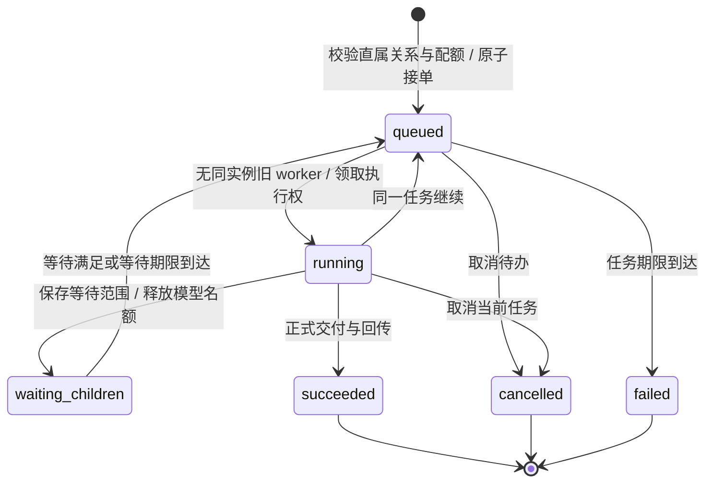

# 团队任务接单与串行工作流

同一个直属角色实例可以接收多项任务。接单只返回持久化的 `task_id` 和 `queued`，调度器随后领取任务；实例忙碌或等待子任务不再使合法委派失败。同一实例一次只执行一项任务，不同实例仍可并行。

## 参考实现与本项目的落点

参考资料核对于 2026-10-03，采用公开源码和官方文档中的模式，没有新增工作流服务或依赖。

| 参考 | 相关模式 | 本项目实现 |
| --- | --- | --- |
| [Codex InputQueueState 源码](https://github.com/openai/codex/blob/main/codex-rs/tui/src/chatwidget/input_queue.rs) | 将执行期间收到的后续输入保存在队列，并区分排队输入与已发送的 steering | 待办任务独立存储；新任务不覆盖当前任务，也不把人工补充消息转换成新任务 |
| [Temporal：处理消息](https://docs.temporal.io/handling-messages) | 接收消息后将工作放入队列，由主工作流按受控顺序处理；使用请求标识去重；结束前处理未完成工作 | 短事务接受委派并保存回执，实例串行领取；等待子任务后收集正式结果再结束父任务 |
| [Temporal Python：消息传递](https://docs.temporal.io/develop/python/workflows/message-passing) | 区分接受、完成和拒绝；等待条件及并发控制 | `queued` 不代表交付；等待释放模型名额；事务已明确拒绝与结果不确定分别处理 |
| [LangGraph：持久化](https://docs.langchain.com/oss/python/langgraph/persistence) | 图检查点保存执行状态，支持中断后继续 | 保留现有 SQLite 检查点和独立业务回执；不依靠内存队列恢复 |

这些是设计参考，KDS 不声称具备上述框架的全部语义。业务库与图检查点仍是两个独立事务域，外部工具副作用无法保证恰好一次；未知结果继续暂停核对。

## 接受、领取与交付

- **接受**：只允许向直属实例委派；全局与祖先子树的任务数、队列长度、子任务数和预算继续限制。接单与回执在同一事务保存；相同请求 ID 和参数重发返回原任务，异参数仍冲突。
- **排序**：按 SQLite 已提交的任务插入顺序领取，避免同时间戳、时钟回拨或随机 UUID 造成乱序。继续及子任务等待使用原任务记录，始终保留其当前实例执行权。
- **执行**：数据库 `current_task_id` 与唯一活动激活约束保护业务状态；Runner 还保留物理 worker 对实例的占用，直到调用和进程关闭结束。取消或超时后清除业务执行权，不代表旧外部进程已退出。
- **取消与期限**：取消排队项只影响该项及其后代，不清除同实例另一项正在执行的任务。任务总时长从接单起计，排队时间包含在内；队列中的任务也可能先到期。
- **结果**：每项任务有独立输入、验收条件、预算及结果，父任务按 `task_id` 等待并收集。`wait_children` 释放请求名额，同时保留实例当前任务，后续任务不能插入到它的多次激活之间。
- **恢复**：队列与接受回执在 SQLite 中保留。重启不会自动执行任务；继续前保留已存确定结果，遇到不确定外部调用仍要求显式核对重试。

## 工具错误与等待

本机命令通道只有在业务事务明确回滚时才返回绑定工具及请求 ID 的拒绝标记。工具桥保存当前 attempt、真实 call ID 对应的证据；适配器逐个核对调用和结果，允许已确认的拒绝与后续成功查询一起提交等待。

原生工具失败、5xx、响应丢失、缺失或不匹配的回执仍属于不确定结果。取消、超时和限额结束优先于自动等待。不能只根据 HTTP 4xx 字样或错误文本断言事务已经回滚。

## 验证位置

`tests/test_team_task_queue.py` 覆盖 queued/running/waiting_children 接单、继续后保持顺序、相同时间戳与时钟回拨、并发接单及重发、有限队列回滚、取消待办、待办到期和暂停恢复。服务测试另验证取消／超时后的旧 worker 收尾与下一任务准入。真实 DSH SDK 使用本机模拟提供商验证确定拒绝后的自动等待，没有请求收费模型。

`tests/test_team_runtime_integration.py` 的 `server_control_queue` 进一步验证真实 SDK 的完整串行闭环：同一子实例接受两项不同输入，稳定请求重发不增加任务；父查询让出唯一执行槽，两项子任务使用不同 task/session ID 依次完成，父得到两份正式结果后交付。最终顺序派发版本通过（68.47 秒），全部 5 个 runtime/session 关闭，没有收费调用。
